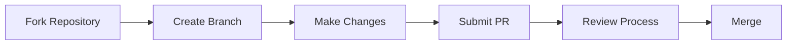

# Developer Onboarding 🚀

<div class="zoom-in">

</div>

## Welcome to the Team!

<div class="fade-in">
This guide will help you get up and running quickly with our development environment, tools, and processes.
</div>

!!! tip "First Steps Checklist"
    - [x] Access the developer portal
    - [ ] Set up your development environment
    - [ ] Meet your team
    - [ ] Complete your first contribution

## 1. Setting Up Your Environment

<div class="slide-in-right">
Follow these steps to get your development environment ready:
</div>

<div class="steps" markdown>

### Install Required Tools

```bash
# Clone the repository
git clone https://github.com/khngu/khngu.github.io
cd khngu.github.io

# Install dependencies
npm install
```

### Configure Your Environment

Create a `.env` file with your local settings (see example in `.env.example`).

### Start the Development Server

```bash
npm start
```

</div>

## 2. Key Resources

<div class="grid cards" markdown>

<div class="fade-in-up delay-1">

- :material-code-tags:{ .lg .middle } **Code Repositories**

  ---

  Access our code repositories and start contributing

  [:octicons-arrow-right-24: GitHub](https://github.com/khngu)

</div>

<div class="fade-in-up delay-2">

- :material-account-group:{ .lg .middle } **Team Structure**

  ---

  Learn about our team structure and find your teammates

  [:octicons-arrow-right-24: Team](team.md)

</div>

<div class="fade-in-up delay-3">

- :material-tools:{ .lg .middle } **Development Tools**

  ---

  Discover the tools we use for development

  [:octicons-arrow-right-24: Tools](tools.md)

</div>

<div class="fade-in-up delay-4">

- :material-school:{ .lg .middle } **Learning Resources**

  ---

  Access training materials and documentation

  [:octicons-arrow-right-24: Docs](https://github.com/khngu/khngu.github.io/tree/main/docs)

</div>

</div>

## 3. Your First Contribution

<div class="fade-in delay-3">

We follow a standard GitHub workflow for contributions:



</div>

!!! success "Ready to start?"
    Now that you're set up, you're ready to make your first contribution! 
    Check out our [Getting Started](getting-started.md) guide for next steps.

## 4. Communication Channels

<div class="slide-in-left">

| Channel | Purpose | How to Join |
| ------- | ------- | ----------- |
| Slack | Daily communication | Ask your team lead for an invite |
| GitHub Discussions | Technical discussions | Automatic access with repo |
| Weekly Meetings | Progress updates | Calendar invite will be sent |

</div>

## 5. Need Help?

<div class="pulse">

If you get stuck or have questions:

1. Check our [Q&A section](../qeta)
2. Ask in the #help Slack channel
3. Reach out to your onboarding buddy

</div>

!!! quote "Developer Tip"
    "The best way to learn is by doing. Don't be afraid to experiment, ask questions, and make mistakes!"
