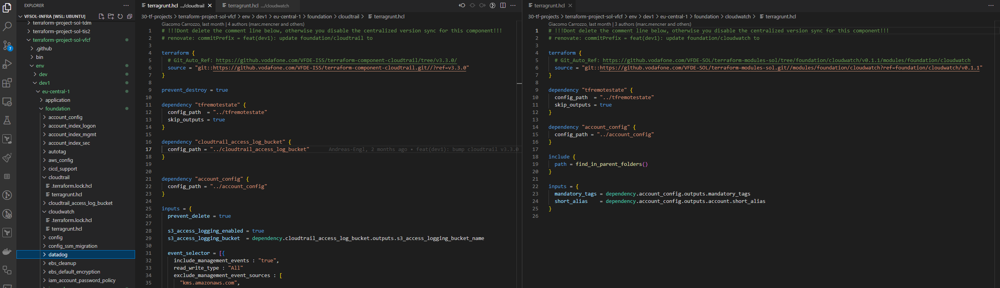
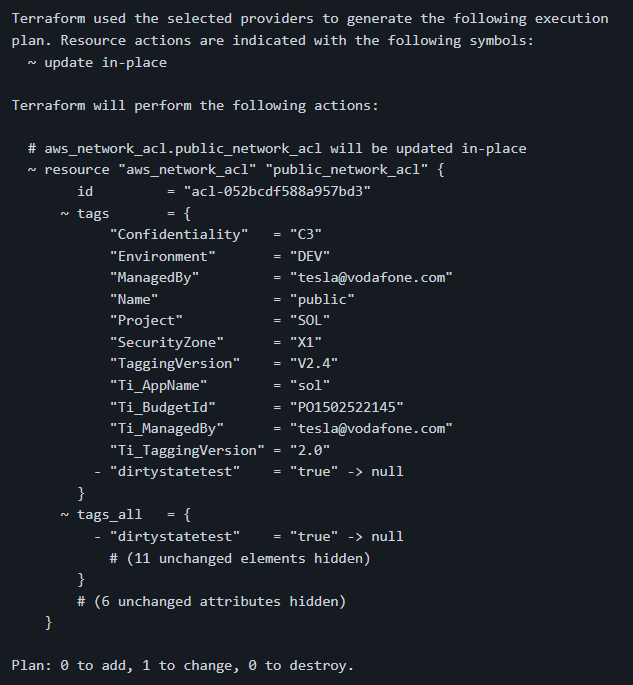
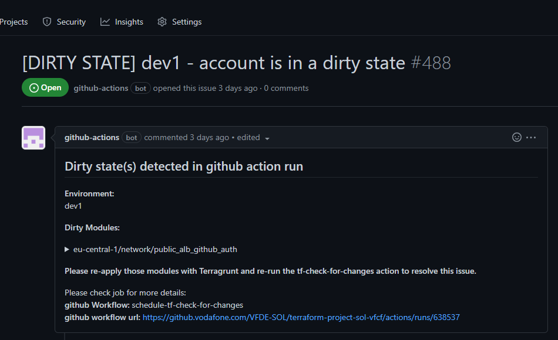

## What is a dirty state

In CET, environments are AWS accounts which infrastructure is defined by collections of Terraform Modules that are deployed by Terragrunt. Those collections are defined in the environment folders of the corresponding terraform-project-repository, like [described here](./infrastructure_development.html).

The HEAD of the master branch of a terraform-project-repository is the commit where these environment folders and their content must be deployed from (or 'applied' like you would say Terraform slang). This way the infrastructure in the AWS accounts matches the state that is decribend in the corresponding environment folder in terraform-project-repository in the HEAD of master.

**This "convention" enables you to know what actually is deployed to your AWS account(s)/environment(s)!!! It is extremly important because it enables you to build new Terraform code and to deploy it in a SAVE AND PREDICTABLE WAY!!!**

|    |
|:-------------------------------------:|
| In HEAD of master of the terraform-project-sol-vfcf for the environment dev1, cloudtrail points to v3.3.0 while cloudwatch points to v0.1.1. So we can assume that the cloudtrail Terraform module is deployed in v3.3.0 and the cloudwatch Terraform module is deployed in v0.1.1 to the dev1 environment. |

If the infrastructure of your AWS account(s)/environment(s) does not match the last commit in master branch, how would you be able to tell what is currently deployed to an environment? Or what additions/modifications need to be made to the infrastructure for fulfilling some business demands? Either you would need to check every single infrastructure resource manually or you can´t. Checking every single resource manually in big and complex scenarios like Solstice is impossible - so basically you cant realy be sure what is actually deployed when you don´t stick to the convention of having deployed what is defined in HEAD master.

But how can those changes appear that differs the state of your infrastructure from the one defined in the environment folder? Mostly those changes arrise on two ways.

1. From local deployment of code that is not part of the HEAD of the master branch of the corresponding terraform-project-repository, e.g. someone deployed some modified Terraform code with Terragrunt from his/her AWS Workspace/Laptop.
2. Someone did changes manually via AWS management console or AWS CLI.



If an AWS infrastructure resource got modified and thus not match its configuration in the codebase (HEAD master of the project-repository) anymore, the module that initially deployed the resource gets a dirty state. (Within Terragrunt every deployed Terraform Module has its own state.)

## How to detect a dirty state?
Fortunately Terragrunt itself is able to detect modified infrastructure resources and thus can detect dirty states. If a Terraform Module gets planed after any of its AWS infrastructure resources got changed, the change will be deteced during the plan, like shown below.

|    |
|:-------------------------------------:|
| Planing output after the public NACL got modified through the addition of the tag dirtystatetest with value true. |

To detect dirty states accross all environments Team Tesla released a GitHub action named schedule-tf-check-for-changes. This actions runs every night. It basically runs a Terragrunt plan command for every single Terraform module of every environment and checks the output. If an environments has at least one module with changes in its plan, a dirty state issue for this environment will get openend in the GitHub repository of the corresponding project.

|    |
|:-------------------------------------:|
| A dirty state issue for the dev1 environment caused by the module network/public_alb_github_auth. |

## How to fix a dirty state?

After we (or the schedule-tf-check-for-changes GitHub action) detected a dirty state, we need to bring the infrastructure and the corresponding codebase back in sync, this can be achieved on two ways.
1. We modify the code of the Terraform module with the dirty state to match the modified AWS infrastructure. (Sometime its sufficient to just change necessary inputs of the Terraform module, otherwise the code of the module itself needs to be adjusted, a new version/tag needs to be released and then sourced in the terraform-project-repository.)
**OR**
2. We deploy the module from master of the terraform-project-repository and revert all changes that were made manually. (with_sol_xxxxxx terragrunt apply)

After following one of the two approaches, we can re-run the schedule-tf-check-for-changes GitHub action. If the dirty state has been fixed, the Github Action will plan the Terraform module again but this time without any changes and close the issue. Beware, if there are other dirty states left in the environment, the issue won´t get closed, instead it will get updated.
For re-running the action, go to the issue in GitHub and click on the workflow url. This will bring you to the last exection of the action. Here you can trigger a re-run for a specific environment of the project. Please try to re-run only the environment that you fixed because re-running the action for all environments is unnecessarilly compute intensive.

|    |
|:-------------------------------------:|
| Re-run the schedule-tf-check-for-changes GitHub action for the environment, in which you fixed a dirty state, by clickling the round arrows symbol next to its name (in this example dev1). |
