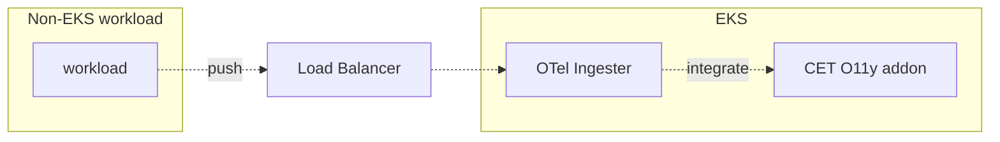

## Architecture

The setup contains of an additional load balancer, backed by OpenTelemetry collectors. This allows to send traffic from arbitrary workloads to the loadbalancer, which forwards it to the OTelCols which are configured to accept, transform and distribute it to the corresponding storage applications.



This solution accept data for metrics, logs and traces. It has to be sent in OTLP format via gRPC protocol.


{}
The default O11y setup does **not** contain the resources for ingesting non-EKS, described in the above diagram. Based on project need, they must be created in addition. See [below](#available-implementations).
{}

## Automatic processing

The ingester OTelCols add a label `k8s_collector` to all incoming data points. The value is set to the pod name processing the data. This label should not be set on the sending side.

## Usage

The recommended way to send data is using an OTel collector as agent alongside the workload. It offers the `otlp` exporter which can communicate with the in-cluster components via the load balancer. The configuration should include something similar to this basic setup:

```yaml
exporters:
    otlp:
        endpoint: https://<LOAD_BALANCER_URL>:4317
        headers:
            compression: gzip
service:
    pipelines:
        metrics:
            exporters:
                - otlp
        logs:
            exporters:
                - otlp
        traces:
            exporters:
                - otlp
```

The workload side is completely up to the teams maintaining it. They are responsible to install and configure how data is sent to the load balancer.

{}
You have to ensure that your workloads can connect to the load balancer (security groups)! The recommended way is to add rules for the private subnets, which can be obtained as an output from the VPC terraform module.
{}

# Available implementations

A few parts are needed to implement the [architecture above](#architecture) and enable O11y for ingesting Non-EKS data:
- an Network Load Balancer ([Terraform module](https://github.vodafone.com/VFDE-SOL/terraform-modules-sol/tree/master/modules/network/private_otel_in_nlb)) -  entry point for the OTel **collectors** to send data ([example](https://github.vodafone.com/VFDE-SOL/terraform-project-sol-abp/blob/master/env/prod-abp/eu-central-1/network/private_otel_in_nlb/terragrunt.hcl))
- an Istio gateway  ([Helm chart](https://github.vodafone.com/VFDE-SOL/k8s-modules-sol/tree/master/charts/istio-routing)) - entry point on edge of the Kubernetes mesh ([example](https://github.vodafone.com/VFDE-SOL/k8s-apps-prod-abp-sol-vfde/blob/master/apps/templates/apps/istio-routing-otel-in.yaml))
- OTel Ingester ([Helm Chart](https://github.vodafone.com/VFDE-SOL/k8s-modules-sol/tree/master/charts/otel-in-collector)) - k8s resources creating an OTel collector, which ingests data outside the cluster ([example](https://github.vodafone.com/VFDE-SOL/k8s-apps-prod-abp-sol-vfde/blob/master/apps/templates/apps/otel-in-collector.yaml))


## Troubleshooting

- Verify locally @ workload: Does the agent run without errors?
- Verify @ load balancer (AWS Console): Are targets registered? Are requests coming through?
- Verify with Grafana: All in-cluster components running?
- Verify @ Istio IGW: Are requests attempted to be routed correctly?
- Verify with Hubble: Are IP packages sent from Istio IGW to OTelCol?
- Verify @ in-cluster OTelCol: Any errors?
- Verify with Grafana: Received anything? Need to know what you’re sending!


## Source code

Other useful links:
- [VFDE-SOL/terraform-modules-base//otelcol-contrib](https://github.vodafone.com/VFDE-SOL/terraform-modules-base/tree/master/modules/otelcol-contrib) offers a configuration file for the OTel collector, sending _generic EC2 host_ metrics and logs to O11y
- [This PR](https://github.vodafone.com/VFDE-SOL/terraform-component-bastionhost/pull/65/files) integrates OTelCol as agent to the bastionhost component
