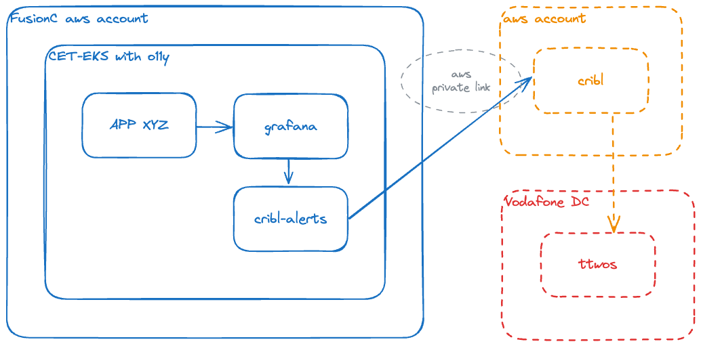

This document provides a comprehensive guide on integrating [Cribl] with [TTWOS] to automate ticket generation via Grafana alertmanager events.

The integration leverages the[_VOIS Service Management Architecture](https://confluence.sp.vodafone.com/display/TSEP) to ensure a scalable and efficient setup.

This guide is intended for system administrators and DevOps engineers who are familiar with AWS, Kubernetes, and monitoring tools like Grafana. By following the steps outlined, you will be able to set up and configure the necessary components to streamline your alert management process.

{}
This solution focuses solely on the Cribl/TTWOS integration. It will not help you create proper alerts in Grafana.

If you are looking for how to create proper alerts in Grafana, please check out [this docs]() first.
{}

## Concept

To create mandatory tickets on [TTWOS] we use the [Cribl] stream integration, provided by the _VOIS Service Management Architecture team.

### High level overview

[](./cribl-ttwos-integration.png)


## Key Features

- Trigger [TTWOS] ticket generation via Grafana alertmanager events
- Scalable EKS setup
- Separation of alert creation and [Cribl] integration
- Grafana [label](https://grafana.com/docs/grafana/latest/alerting/fundamentals/alert-rules/annotation-label/) support to configure alerts

## Preconditions

- [CET-EKS] cluster with [o11y] addon
- Your team/application must be onboarded to [TTWOS]
- Established AWS PrivateLink between FusionC and Cribl account ([terraform-component-privatelink](https://github.vodafone.com/VFDE-SOL/terraform-component-privatelink/tree/master/modules/endpoint/consuming#input_vodafone_endpoints))
- Deployed [cribl-alerts] tool on the EKS cluster ([cribl-alerts-chart])

## Getting Started

### Establish AWS PrivateLink Connection

First, you need to be able to reach the [Cribl] endpoint, normally available under `https://cribl-01.prod.fra.tssa.vodafone.com:21502/cribl/_bulk`.


All FusionC production accounts ([v3](https://github.vodafone.com/pages/VFDE-SOL/docs-sol-cet/docs/core_concepts/#vodafone-fusionc-cet-account)), which were available before **8th October 2024**, are already allowed to establish PrivateLink connection.

All other or new accounts need to get in touch with [Maher Rashed](maher.rashed@vodafone.com) from the *_VOIS Monitoring Engineering & Operation Team*, or with [Aya ElNagar](aya.el-naggar@vodafone.com)  as a backup contact. Send them an email with the subject "*Allow AWS accounts to the existing Grafana source on Cribl AWS*" and include your account number(s).


To finally establish the PrivateLink connection, you can use the feature in our [terraform-component-privatelink](https://github.vodafone.com/VFDE-SOL/terraform-component-privatelink/tree/master/modules/endpoint/consuming#input_vodafone_endpoints) component, which should already be installed in your account.

[Here](https://github.vodafone.com/VFDE-SOL/terraform-project-sol-done/blob/master/env/dev-staging-done/eu-central-1/network/privatelink/consuming/terraform.tfvars#L12-L13) you find an example of an established connection and [here](https://github.vodafone.com/VFDE-SOL/terraform-project-sol-done/pull/575/files) and example PR.

### Deploy cribl-alerts

To "translate" the Grafana alert to a valid [Cribl] request and handle authentication, we provide a lightweight [cribl-alerts] tool, which you need to run on your [CET-EKS] cluster.

Please check the latest version of our [cribl-alerts-chart] to install the tool on your cluster.

{}
You need to be aware of your TTWOS category, application, and object, which you get during your TTWOS onboarding.
{}

**Example App Deployment:**

```yaml
apiVersion: argoproj.io/v1alpha1
kind: Application
metadata:
  name: cribl-alerts
  labels:
    project: "{{ .Values.projectName }}"
    account: "{{ .Values.accountName }}"
    clusterName: "{{ .Values.clusterName }}"
  finalizers:
    - resources-finalizer.argocd.argoproj.io
spec:
  destination:
    namespace: cribl-alerts
    server: "{{ .Values.eks.server }}"
  project: target
  source:
    path: charts/cribl-alerts/chart
    repoURL: https://github.vodafone.com/VFDE-SOL/k8s-modules-sol
    targetRevision: cribl-alerts/v0.6.0
    helm:
      values: |
        criblalerts:
          logging:
            level: warn
          cribl:
            event:
              # default values for the event if the label is not found
              category: app_de-aws-foobar
              application: aws-foobar
              object: app
  syncPolicy:
    automated:
      prune: true
      selfHeal: true
    syncOptions:
      - CreateNamespace=true
```

### Setup o11y

To enable Grafana to send alerting events to [Cribl], we use the [Alertmanager Webhook Receiver](https://prometheus.io/docs/operating/integrations/#alertmanager-webhook-receiver).

#### Configuration

You need to add your own `webhookReceivers` to your o11y deployment, which you find mostly under `cet-eks-o11y.yaml`.
By setting `matchers` to the label `o11y_fwd_cribl`, we can now simply activate alerts to send to [Cribl] by setting the label:

```yaml
apiVersion: argoproj.io/v1alpha1
kind: Application
# [..]
spec:
  # [..]
  source:
    # [..]
    helm:
      values: |
        # [..]
        config:
          # [..]
          alerts:
            webhookReceivers:
              - name: cribl
                url: http://cribl-alerts.cribl-alerts.svc.cluster.local:8080/api/alert
                sendResolved: true
            # [..]
            routes:
              - receiver: cribl
                matchers:
                  - o11y_fwd_cribl = "true"
                continue: true
              # [..]
```

## Configure alerts

You need to be aware of your [TTWOS] category, application, and object, which you get during your [TTWOS] onboarding.
On alert level, you can activate the [TTWOS] ticket creation by setting the label `o11y_fwd_cribl: "true"` to the alert, which should trigger the event.

You can also handle the `severity` and optionally the [TTWOS] parameters on alert level by setting up the fitting labels:

```yaml
apiVersion: monitoring.coreos.com/v1
kind: PrometheusRule
# [..]
spec:
  groups:
  - name: my-app-alerts
    rules:
    # [..]
    - alert: app-issue
      # [..]
      labels:
        o11y_fwd_cribl: "true"
        severity: minor
        # optional settings on alert level
        criblalerts_category: app_de-aws-common-config
        criblalerts_application: aws-common-app
        criblalerts_object: app
        # [..]
```

{}
Please note that it is not necessary to trigger TTWOS ticket creation for non-production environments. You can configure all your necessary alerts in each environment and send them to an MS Teams channel, for example. **Only in the production environment should you send alerts to TTWOS.**

You can achieve this by omitting the `webhookReceivers` and related `matchers` from your o11y deployment in non-production environments.
{}

## Further links

- **cribl-alerts:** https://github.vodafone.com/VFDE-SOL/tool-cribl-alerts
- **cribl-alerts-chart:** https://github.vodafone.com/VFDE-SOL/k8s-modules-sol/tree/master/charts/cribl-alerts
- **terraform-component-privatelink:** https://github.vodafone.com/VFDE-SOL/terraform-component-privatelink/tree/master/modules/endpoint/consuming
- **Request "New Cribl Onboarding":** https://oneitsm-dwp.onbmc.com/dwp/app/#/itemprofile/11601

<!-- markdown links -->
[Cribl]: https://cribl.io/
[cribl-alerts]: https://github.vodafone.com/VFDE-SOL/tool-cribl-alerts
[cribl-alerts-chart]: https://github.vodafone.com/VFDE-SOL/k8s-modules-sol/tree/master/charts/cribl-alerts
[TTWOS]: https://de.confluence.agile.vodafone.com/display/VFITDOC/TTWOS
[CET-EKS]: https://github.vodafone.com/VFDE-ISS/cet-eks
[o11y]: https://github.vodafone.com/VFDE-ISS/cet-eks-o11y
