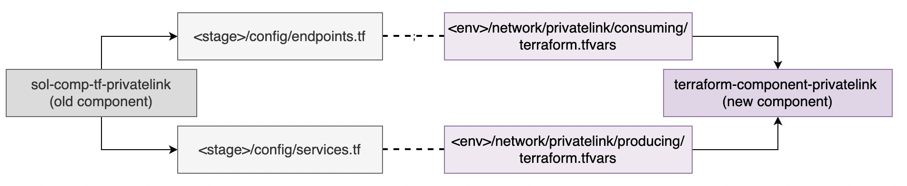

## Repository:

[terraform-component-privatelink](https://github.vodafone.com/VFDE-SOL/terraform-component-privatelink)

> Important note - *document is still under construction, please reach out to [Team Tesla](https://de.jira.agile.vodafone.com/secure/ShowObject.jspa?id=535582) in case of issues or questions*


# Component structure


As diagram above suggests, what was defined before in config/endpoints.tf and config/services.tf is now migrated to .tfvars to separate consuming and producing endpoints.
Syntax of .tfvars was kept as close as possible to the old configuration file so that project teams can easily onboard and deploy.

# Deployment workflow
## Consuming endpoints
Configure what resources an account environment should 'consume' (previously defined in \<stage>/config/endpoints.tf)
1. Pull new project from repository ex. terraform-project-sol-myproject
2. Navigate to /env/\<env-name>/\<region>/network/privatelink/consuming
3. .tfvars holds values for the environment endpoints, 'vodafone' related endpoints as well as custom endpoints for the environment
    - Vodafone endpoints like trendmicro, deployvip, eks_tool etc. can be deployed by toggling deploy parameter on/off
        > example: `eks_tool = {
            deploy           = true
        }`
4. Configure .tfvars
Project specific endpoints are defined as a map
    ```sh
    # specify account domains to create hosted zones on route53
    connected_account_domain_names = [
        "internal.vodafone.com",
        "mgmt.sol-vf.de"
    ]

    # endpoints with pre-defined parameters, only requirement is to enable/disable as required per environment
    vodafone_endpoints = {
        vf_deployvip   = { deploy = true },                     # deployment requires principal to be allowed
        vf_trend_micro = { deploy = true },                     # security endpoint managed internally
        vf_smtp_relay  = { deploy = false },                    # internal mail relay endpoint
        eks_tools_mgmt = { deploy = false }                     # recommended if account has an EKS cluster
    }

    consuming_endpoints = {
        vf_burpsuite = {                                        # endpoint name
            deploy       = true                                 # toggle endpoint deployment
            service_name = "com.amazonaws.vpce.eu-central-1.vpce-svc-0fd16ff7305e59422g" # or a 'meta_endpoint'
            security_groups = {                                 # define ingress and egress rules directly for each endpoint
                ingress = [{
                    from_port   = 8443
                    to_port     = 8443
                    protocol    = "TCP"
                    cidr_blocks = "vpc_cidrs"                   # specified as params_map reference or as a cidr range
                    }, {
                    from_port   = 443
                    to_port     = 443
                    protocol    = "TCP"
                    cidr_blocks = "vpc_cidrs"
                    }]
                    // egress = []                              # optional, can be left commented out
                }
                private_dns_enabled = true
                dns = [{                                        # DNS shortcuts (if any) can be an empty list
                    id        = "main"                          # shortcut name
                    zone_name = "aws.solstice.vodafone.com"     # domain needs to be part of 'connected_account_domain_names'
                    name      = "oss-som-int-man-1.art-int02"   # subdomain prefix
                    },
                ]
            }
        }
    ```
5. Configure .hcl
Parameters can also be passed through terragrunt.hcl residing in same folder. Outputs coming from other dependencies can be used here as inputs
```sh
inputs = {
    params_map = { # map here string values from .tfvars to real variables or values
        "vpc_cidrs" = dependency.vpc.outputs.vpc_cidr
    }
    subnet_ids                  = dependency.vpc.outputs.subnetgroup_private.subnets
    tags                        = dependency.account_config.outputs.mandatory_tags
    vpc_cidr                    = dependency.vpc.outputs.vpc_cidr
    vpc_id                      = dependency.vpc.outputs.vpc_id
    vpce_notification_topic_arn = dependency.notification.outputs.topic_map["info-topic-arn"]
}
```

6. On a dedicated branch commit the changes and create a PR to merge to master
7. After PR approval, write a comment in PR `atlantis apply` to apply the actual changes and merge the branch.

## Producing services
Configure VPC Service endpoints an account environment is 'producing' (previously defined in \<stage>/config/services.tf)
1. Pull new project from repository ex. terraform-project-sol-myproject
2. Navigate to /env/\<env-name>/\<region>/network/privatelink/producing
3. Configure .tfvars
Project specific services are defined as a map
 ```sh
producing_services = {
    eks_tool = {
        deploy           = true                 # toggle endpoint deployment
        nlb_arn          = "some_nlb_arn"       # specified as params_map reference from .hcl or directly as ARN
        suggested_dns    = ["*.tool", "tool"]   # subdomain prefixes
        allowed_accounts = ["own", "mgmt", "connectivity_mgmt"] # account references need to be specified in .hcl params_map object
        dns_shortcuts = [
            {
                id      = "tool"                                            # shorcut name (can be anything)
                zone_id = "public_hosted_zone_id"                           # zone id as a referenced in .hcl
                name    = "tool.dev.afms.sol-vf.de"                         # full DNS name
                target  = "tool.dev.afms.sol-vf.endpoint.mgmt.dxl-vf.de"    # producing service target
            },
            {
                id      = "all_tool"
                zone_id = "public_hosted_zone_id"
                name    = "*.tool.dev.afms.sol-vf.de"
                target  = "tool.dev.afms.sol-vf.endpoint.mgmt.dxl-vf.de"
            },
        ]
    }
}
```
4. Configure .hcl
```sh
inputs = {
    allowed_account_ids = { # account id values for accounts specified in .tfvars
        # connectivity_mgmt     = 971374.....
        # mgmt                  = dependency.config-ssm-migration.outputs.account_ids["mgmt"]
    }
    params_map = { # map here string values from .tfvars to real variables or values
        "vpc_cidrs"             = dependency.vpc.outputs.vpc_cidr
        # "concourse_nlb_arn"   = "arn:aws:elasticloadbalancing:........"
    }
    account_short_alias         = dependency.account_config.outputs.account.short_alias
    meta_hosted_zone_id         = dependency.dns.outputs.meta.zone_id
    private_hosted_zone_id      = dependency.dns.outputs.internal_private.zone_id
    public_hosted_zone_id       = dependency.dns.outputs.internal_public.zone_id
    subnet_ids                  = dependency.vpc.outputs.subnetgroup_private.subnets
    vpc_cidr                    = dependency.vpc.outputs.vpc_cidr
    vpc_id                      = dependency.vpc.outputs.vpc_id
    vpce_notification_topic_arn = dependency.endpoints_consuming.outputs.endpoint_notification_topic_arn
    tags                        = dependency.account_config.outputs.mandatory_tags
}
```
5. On a dedicated branch commit the changes and create a PR to merge to master
6. After PR approval, write a comment in PR `atlantis apply` to apply the actual changes and merge the branch.

# Management account changes

In case an account has some 'producing services' exposed and they need to be consumed from mgmt account, follow outlined steps to make the configuration change in mgmt repository:

1. Pull [management repository](https://github.vodafone.com/VFDE-SOL/terraform-project-sol-mgmt)
2. Navigate to /env/\<env-name>/\<region>/network/privatelink/consuming
3. Configure .tfvars to consume this new service.
As an example, take this code change for [cmpa eks](https://github.vodafone.com/VFDE-SOL/terraform-project-sol-mgmt/commit/5441d1d1214f95b1ad6c02631577a2c0ac08f979)
5. Configure terragrunt.hcl, if required
6. On a dedicated branch commit the changes and create a PR to merge to master
7. After PR approval, write a comment in PR `atlantis apply` to apply the actual changes and merge the branch.

# Common errors
For a list of frequently asked questions and common errors, visit [Privatelink FAQ]()
