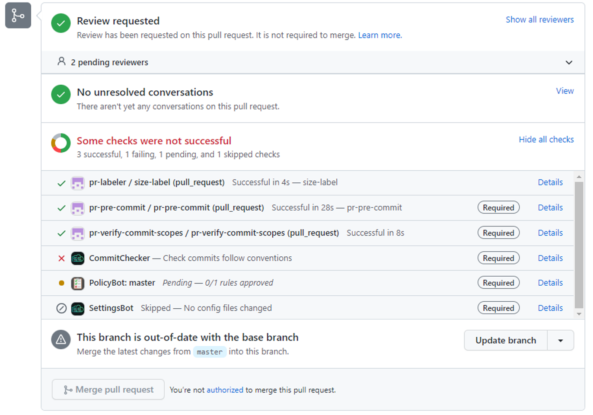
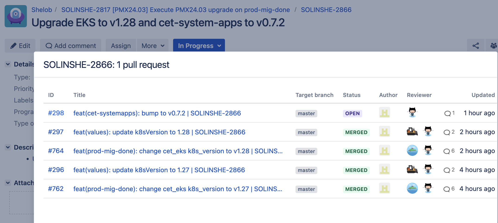


Remember it is a common curtesy to mark PRs as draft when you are not ready for a review. Please see [Contribution Guide]().


Pull requests (PRs) allow you to share changes you've pushed to a branch in a GitHub repository. Once a pull request is opened, you can discuss and review potential changes with collaborators, adding follow-up commits before merging them into the base branch.

A well-drafted pull request demonstrates your respect for others in the project and reflects your professionalism. Just like commit messages, pull requests are a permanent record. They can highlight your positive contributions to the project, or, if poorly handled, they can do the opposite.

Keeping this in mind can help you develop good habits. Here are some common mistakes and how to address them.

Following these guidelines makes reviewing significantly easier. If your initial PR version is well-prepared, it can be merged quickly, avoiding the back-and-forth of corrections and saving time for everyone involved.


## Code of Conduct

You find our [Code of Conduct](https://github.vodafone.com/VFDE-SOL/.github/blob/main/CODE_OF_CONDUCT.md#code-of-conduct) linked in all **VFDE-SOL** repositories. Please familiarize yourself with it before your first contribution.

## Take into account Repository Ownership

Before opening a pull request (PR) on another team's repository, it's courteous to first open an issue and include the content of your PR description.

This facilitates discussion, but remember, the repository owner is under no obligation to accept your suggestion. Your contribution should be clearly advantages to the code.

In your PR description, you can then add "Resolves #23" (replacing #23 with the issue number), which will link the PR to the issue.

If a repo does not want to have your contribution you can always fork and maintain your own. If you escalate or request meetings you should have a valid reason.

## Miscommunication

Clear communication is key. Therefore, don't spread information on personal chats. If someone wants to delegate reviews or is unexpectedly unavailable, someone else has to take over - this person needs to have all the details.

- PR title should probably match your first commit
- **Provide Proper Information**: Here is an incomplete list of useful information depending on the scenario:
  - **Reason**: Why do we need this?
  - **Reference**: Where is this deployed, so a reviewer can take a look?
  - **Validation**: How can this be tested? All provided tests (like a step-by-step guide or a console command) are expected to succeed.
  - **Context**: Who has approved this change (on a non-technical level)? Sometimes, reviewers are not on your team and will not merge anything with significant changes unless a lead engineer or product owner approves. Please add links to other PRs/issues, Jira tickets or whatever adds benefit.
- **Creator's Responsibility**: You, as the creator, are the main driver for the PR. Reviewers may not care or care less. It's your responsibility to keep the PR actively worked on. You can reach out to individuals and kindly ask for a review, but avoid spreading information.
- **Use PR Metadata**: You can set labels and use the *draft* state to indicate the current situation.
- **Screenshots**: Be conservative with screenshots. Use them sparingly when needed (they have the downside of not being searchable).
- **Form-Filling**: Don't fill out a form if you can describe what it does in one sentence.


The art is to write a PR description that includes all the information needed to make sense of it, yet concise enough for a quick review and later reference.


## Failing checks

The image below shows the check section of every PR. Some checks are **required**, indicated on the right hands side in bold. PRs with failing checks cannot be merged. Fix the checks on your own. There's a *Detail* link per check that might explain what is wrong.




Do not expect anyone to work on PRs if there are failing checks - they won't!


## Out of date / rebase / linear history / merge commit

All repositories enforce linear histories, meaning commit trees like this are not allowed and will never be merged

```shell
$ git log --oneline --graph
*   859e969 (HEAD -> feat/xyz, origin/feat/xyz) Merge branch 'master' into feat/xyz
|\
| * 7a1f124 (origin/master, origin/HEAD, master) ...
| * 09080d3 ...
* | 9e4f0d8 ...
|/
* 311eb34 ...
```


A commit with "Merge branch ..." as title is always wrong!


You must never merge a branch locally. By default, it creates a merge commit and you're doomed. Get used to `git fetch && git rebase origin/master`. It updates your branch locally. Follow the terminal output in case of merge conflicts.


To not merge by accident while pulling, run `git config --global pull.ff only` to disallow this behavior.


To update your branch from the GitHub UI, use the dropdown next to the out of date indicator and choose *Update with rebase* (see image above).

If everything's broken and you don't know how to fix it, you can run `git reset --soft master`. It keeps all your changes but goes back to (local) master revision. Now you can commit everything again and run `git fetch && git rebase origin/master` afterwards.

## Closing a PR and creating a new one

Don't do it!

- It's never necessary.
- You spam everyone with notifications.
- You spread information - everything in the old PR is not visible in the new one.
- You spam everyone with notifications.
- You reset all work done e.g. submitting reviews. This breaks other engineers' workflows.
- You spam everyone with notifications.

Just [force-push]() changes to the same branch. You cannot break anything, the master branch is protected.

# Code Review Guidelines

Code reviews enhance code quality, clarity, and reduce technical debt. For beginners, this process can be stressful, but remember: the focus is on the code, not the person.

## Reminders for Code Reviewers

- **Commit to the Review**: If you start a review, complete it thoroughly.
- **Integrity Over Favors**: Do not approve a PR just as a favor.
- **Maintain Standards**: Approve only if the code meets minimum standards.
- **Equal Quality**: Ensure the code is as good as what you would submit.
- **Clean Commits**: Commits should be logical and meaningful.
- **Active Voice in Commit Messages**: Ensure message uses active verbs (e.g., bump, add, rm).
- **Proper Scope**: Ensure commits use correct scopes (e.g., `feat`, `fix`) and targets.
- **Inline Code Changes**: Request changes through inline comments.
- **Reasoned Requests**: Provide reasoning for requested changes (e.g., "we do not use inline policies, please use...").
- **Link to Better Code**: Include links to improved code snippets when applicable.
- **Objectivity**: Stay objective in your feedback.
- **Friendly but Firm**: Maintain a friendly but firm tone.
- **Approval**: Approve only when completely satisfied.
- **Request Changes**: After you request changes convert the PR to draft if changes are needed.

## Reminders for Code Review Requesters

- **Respect Reviewer's Time**: Remember, reviewers have their own work too.
- **Focus on Code**: The review is about the code, not you.
- **Growth Opportunity**: Use the review to improve as a developer.
- **Respect in PR**: High-quality PRs and commits show respect.
- **Concise PR Titles**: Keep PR titles clear and consistent.
- **Clear PR Descriptions**: Make descriptions easy to read and show the intention clearly.
- **Ready for Review**: Ensure all checks (except policy bot) are passed before requesting a review.
- **Handle Requested Changes**: If changes are requested, work on them and commit logically.
- **Commit Messages**: Do not use "as per review"; focus on the component.
- **No Review History in Git**: The review process should not clutter the git history.
- **Understand Feedback**: Use inline conversations for questions only after attempting to understand the request.
- **Close Conversations**: Close conversations once issues are resolved (consider adding the commit for extra clarity).
- **Re-mark as Ready**: Mark the PR as ready for review again after addressing all issues.


## Linking Jira

If you want your PRs to show up in a JIRA ticket please use one of the following:

### Linking Jira issue key by branch name

Check out a new branch in your repo, using the issue key in the branch name. For example: `git checkout -b feat/DEV-2095-<branch-name>`.

### Postfix issue key in PR title

When you create a pull request, use the issue key in the pull request title. Convention is add it at the end `| DEV-2095`.

Example:

A PR title

```sh
feat(cet-systemapps): bump to v0.7.2
```

becomes

```sh
feat(cet-systemapps): bump to v0.7.2 | SOLINSHE-2866
```

[jira-documenation](https://support.atlassian.com/jira-cloud-administration/docs/use-the-github-for-jira-app)



Please DO NOT use issue keys in your commit message, we use angular style commits please see [How to git]()


### Result


