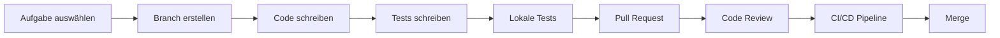

# 🔍 Erste Schritte

Dieser Guide führt dich durch die ersten konkreten Schritte im Projekt. Folge den Anleitungen Schritt für Schritt, um deine Entwicklungsumgebung aufzusetzen und erste Aufgaben zu erledigen.

## 🚀 Entwicklungsumgebung einrichten

<details>
<summary>Schritt 1: Repository klonen</summary>

### Git Repository einrichten

1. Öffne dein Terminal
2. Klone das Repository mit:
   ```bash
   git clone https://github.com/company-org/project.git
   cd project
   ```
3. Installiere die Git-Hooks:
   ```bash
   npm run setup-hooks
   ```

**Hinweis:** Du benötigst Zugang zum GitHub-Repository. Falls du noch keinen Zugang hast, folge der Anleitung auf der [Tools-Seite](/tools).
</details>

<details>
<summary>Schritt 2: Abhängigkeiten installieren</summary>

### Node.js Abhängigkeiten

1. Stelle sicher, dass du Node.js 18.x LTS installiert hast:
   ```bash
   node --version
   # Sollte v18.x.x ausgeben
   ```

2. Installiere die Projektabhängigkeiten:
   ```bash
   npm install
   ```

3. Überprüfe die Installation:
   ```bash
   npm run verify
   ```

**Problembehandlung:** Falls Fehler auftreten, prüfe die Troubleshooting-Sektion am Ende dieses Dokuments.
</details>

<details>
<summary>Schritt 3: Lokale Umgebung starten</summary>

### Entwicklungsserver starten

1. Starte die Datenbank und abhängige Services:
   ```bash
   docker-compose up -d
   ```

2. Initialisiere die Datenbank:
   ```bash
   npm run db:migrate
   npm run db:seed
   ```

3. Starte den Entwicklungsserver:
   ```bash
   npm run dev
   ```

4. Öffne [http://localhost:3000](http://localhost:3000) in deinem Browser

**Erfolg:** Du solltest die Startseite der Anwendung sehen.
</details>

<details>
<summary>Schritt 4: Tests ausführen</summary>

### Test-Suite ausführen

1. Starte die Test-Suite:
   ```bash
   npm test
   ```

2. Führe die End-to-End Tests aus:
   ```bash
   npm run test:e2e
   ```

**Erwartung:** Alle Tests sollten erfolgreich durchlaufen.
</details>

## 🧪 Erste Aufgabe

<details>
<summary>Eine einfache Änderung vornehmen</summary>

### Deine erste Codeänderung

1. Erstelle einen neuen Feature-Branch:
   ```bash
   git checkout -b feature/my-first-change
   ```

2. Öffne die Datei `src/components/Welcome.tsx`

3. Ändere den Begrüßungstext:
   ```tsx
   // Ändere diese Zeile
   const welcomeMessage = "Willkommen im Projekt!";
   
   // In etwas wie
   const welcomeMessage = "Hallo Welt - meine erste Änderung!";
   ```

4. Starte den Entwicklungsserver und überprüfe deine Änderung:
   ```bash
   npm run dev
   ```

5. Schreibe einen Test für deine Änderung:
   ```tsx
   // In src/components/__tests__/Welcome.test.tsx
   it('displays the correct welcome message', () => {
     render(<Welcome />);
     expect(screen.getByText("Hallo Welt - meine erste Änderung!")).toBeInTheDocument();
   });
   ```

6. Führe die Tests aus:
   ```bash
   npm test
   ```

7. Committe und pushe deine Änderungen:
   ```bash
   git add .
   git commit -m "Meine erste Änderung: Willkommenstext aktualisiert"
   git push -u origin feature/my-first-change
   ```

8. Erstelle einen Pull Request im GitHub Repository

**Nächste Schritte:** Bitte deinen Mentor, den Pull Request zu überprüfen.
</details>

## 🔄 Workflow-Überblick

Unser Entwicklungsprozess folgt diesem Workflow:



## 📋 Coding Standards

<details>
<summary>Code-Konventionen</summary>

### TypeScript Styleguide

Wir verwenden die folgenden Konventionen:

- **Formatierung**: Prettier mit Standard-Konfiguration
- **Linting**: ESLint mit unseren benutzerdefinierten Regeln
- **Benennung**:
  - Komponenten: PascalCase (z.B. `UserProfile`)
  - Funktionen: camelCase (z.B. `getUserData`)
  - Konstanten: UPPER_SNAKE_CASE (z.B. `API_URL`)
- **Imports**: Gruppieren nach externen und internen Imports

### Beispiel:

```tsx
// Externes Paket
import React, { useState, useEffect } from 'react';

// Interne Imports
import { UserData } from '@/types';
import { fetchUserData } from '@/api';
import { UserAvatar } from '@/components';

// Konstanten
const UPDATE_INTERVAL = 60000; // 1 Minute

// Komponente
export const UserProfile: React.FC<{ userId: string }> = ({ userId }) => {
  const [userData, setUserData] = useState<UserData | null>(null);

  useEffect(() => {
    const loadData = async () => {
      const data = await fetchUserData(userId);
      setUserData(data);
    };

    loadData();
    const interval = setInterval(loadData, UPDATE_INTERVAL);
    
    return () => clearInterval(interval);
  }, [userId]);

  return (
    <div className="user-profile">
      {userData ? (
        <>
          <UserAvatar src={userData.avatar} />
          <h2>{userData.name}</h2>
          <p>{userData.bio}</p>
        </>
      ) : (
        <p>Lade Benutzerdaten...</p>
      )}
    </div>
  );
};
```
</details>

## 🐛 Troubleshooting

<details>
<summary>Häufige Probleme und Lösungen</summary>

### Node.js Version Mismatch

**Problem:** Fehlermeldungen bei der Installation von Abhängigkeiten.

**Lösung:** Überprüfe deine Node.js Version und aktualisiere sie auf die empfohlene Version:
```bash
# Installiere nvm (Node Version Manager)
curl -o- https://raw.githubusercontent.com/nvm-sh/nvm/v0.39.0/install.sh | bash

# Installiere die richtige Node-Version
nvm install 18
nvm use 18
```

### Datenbank-Verbindungsprobleme

**Problem:** Der Server kann keine Verbindung zur Datenbank herstellen.

**Lösung:** Überprüfe, ob Docker läuft und die Datenbank-Container gestartet sind:
```bash
docker ps
# Sollte einen PostgreSQL-Container anzeigen

# Falls nicht, starte die Container neu:
docker-compose down
docker-compose up -d
```

### Port bereits in Benutzung

**Problem:** Der Port 3000 wird bereits von einer anderen Anwendung verwendet.

**Lösung:** Ändere den Port in der `.env`-Datei:
```bash
# Öffne die .env-Datei
nano .env

# Ändere PORT=3000 zu PORT=3001
```

### Nicht genügend Berechtigungen

**Problem:** Git-Fehler aufgrund fehlender Berechtigungen.

**Lösung:** Überprüfe deine GitHub-Zugangsdaten und SSH-Schlüssel:
```bash
# SSH-Schlüssel generieren
ssh-keygen -t ed25519 -C "deine.email@example.com"

# Öffentlichen Schlüssel anzeigen
cat ~/.ssh/id_ed25519.pub

# Füge diesen Schlüssel in deinen GitHub-Account ein
```
</details>

## 📢 Hilfe bekommen

Falls du weitere Unterstützung benötigst:

1. Frage im Slack-Kanal `#tech-support`
2. Wende dich an deinen Mentor
3. Besuche die wöchentliche Sprechstunde (Donnerstags, 14:00-15:00 Uhr)

Wir wünschen dir viel Erfolg bei deinen ersten Schritten im Projekt!
