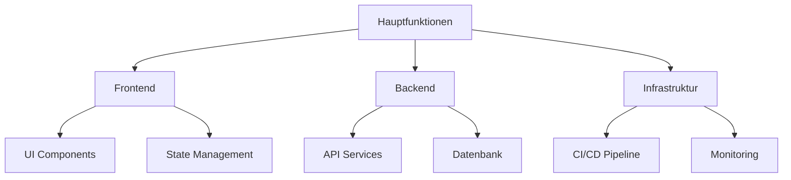

# 🚀 Willkommen zur Projekt-Dokumentation

Willkommen im Dokumentationsportal unseres Teams! Diese Seiten sollen dir helfen, dich schnell und effizient in unser Projekt einzuarbeiten.

## 📚 Was du hier findest

Diese Dokumentation bietet dir:

- [👋 Onboarding Guide](/onboard) - Dein Start bei uns
- [🛠️ Tools und Ressourcen](/tools) - Alle wichtigen Werkzeuge im Überblick
- [🔍 Erste Schritte](/getting-started) - Konkrete Anleitungen für den Einstieg
- [👥 Unser Team](/team) - Lerne deine Kolleg:innen kennen

## 🌟 Unser Projekt auf einen Blick

## 💡 Quick Links

- [GitHub Repository](https://github.com/username/project)
- [JIRA Board](https://yourcompany.atlassian.net/jira)
- [Confluence Wiki](https://yourcompany.atlassian.net/wiki)
- [Teams Channel](https://teams.microsoft.com)

## 🔄 Letztes Update

Diese Dokumentation wird regelmäßig aktualisiert, um aktuelle Informationen zu gewährleisten.
Letztes Update: April 2025
