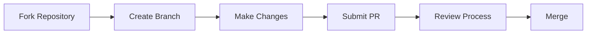

# Developer Onboarding 🚀

<div style="animation: zoomIn 1.2s;">

</div>

## Welcome to the Team!

<div style="animation: fadeIn 1.5s;">
This guide will help you get up and running quickly with our development environment, tools, and processes.
</div>

!!! tip "First Steps Checklist"
    - [x] Access the developer portal
    - [ ] Set up your development environment
    - [ ] Meet your team
    - [ ] Complete your first contribution

## 1. Setting Up Your Environment

<div style="animation: slideInRight 1s;">
Follow these steps to get your development environment ready:
</div>

<div class="steps" markdown>

### Install Required Tools

```bash
# Clone the repository
git clone https://github.com/khngu/khngu.github.io
cd khngu.github.io

# Install dependencies
npm install
```

### Configure Your Environment

Create a `.env` file with your local settings (see example in `.env.example`).

### Start the Development Server

```bash
npm start
```

</div>

## 2. Key Resources

<div class="grid cards" markdown>

<div style="animation: fadeInUp 0.8s;">

- :material-code-tags:{ .lg .middle } **Code Repositories**

  ---

  Access our code repositories and start contributing

  [:octicons-arrow-right-24: GitHub](https://github.com/khngu)

</div>

<div style="animation: fadeInUp 1.1s;">

- :material-account-group:{ .lg .middle } **Team Structure**

  ---

  Learn about our team structure and find your teammates

  [:octicons-arrow-right-24: Team](team.md)

</div>

<div style="animation: fadeInUp 1.4s;">

- :material-tools:{ .lg .middle } **Development Tools**

  ---

  Discover the tools we use for development

  [:octicons-arrow-right-24: Tools](tools.md)

</div>

<div style="animation: fadeInUp 1.7s;">

- :material-school:{ .lg .middle } **Learning Resources**

  ---

  Access training materials and documentation

  [:octicons-arrow-right-24: Docs](https://github.com/khngu/khngu.github.io/tree/main/docs)

</div>

</div>

## 3. Your First Contribution

<div style="animation: fadeIn 2s;">

We follow a standard GitHub workflow for contributions:



</div>

!!! success "Ready to start?"
    Now that you're set up, you're ready to make your first contribution! 
    Check out our [Getting Started](getting-started.md) guide for next steps.

## 4. Communication Channels

<div style="animation: slideInLeft 1.2s;">

| Channel | Purpose | How to Join |
| ------- | ------- | ----------- |
| Slack | Daily communication | Ask your team lead for an invite |
| GitHub Discussions | Technical discussions | Automatic access with repo |
| Weekly Meetings | Progress updates | Calendar invite will be sent |

</div>

## 5. Need Help?

<div style="animation: pulse 2s infinite;">

If you get stuck or have questions:

1. Check our [Q&A section](../qeta)
2. Ask in the #help Slack channel
3. Reach out to your onboarding buddy

</div>

!!! quote "Developer Tip"
    "The best way to learn is by doing. Don't be afraid to experiment, ask questions, and make mistakes!"

<style>
@keyframes fadeIn {
  from { opacity: 0; }
  to { opacity: 1; }
}

@keyframes zoomIn {
  from { transform: scale(0.8); opacity: 0; }
  to { transform: scale(1); opacity: 1; }
}

@keyframes slideInRight {
  from { transform: translateX(50px); opacity: 0; }
  to { transform: translateX(0); opacity: 1; }
}

@keyframes slideInLeft {
  from { transform: translateX(-50px); opacity: 0; }
  to { transform: translateX(0); opacity: 1; }
}

@keyframes fadeInUp {
  from { transform: translateY(20px); opacity: 0; }
  to { transform: translateY(0); opacity: 1; }
}

@keyframes pulse {
  0% { transform: scale(1); }
  50% { transform: scale(1.03); }
  100% { transform: scale(1); }
}
</style>
