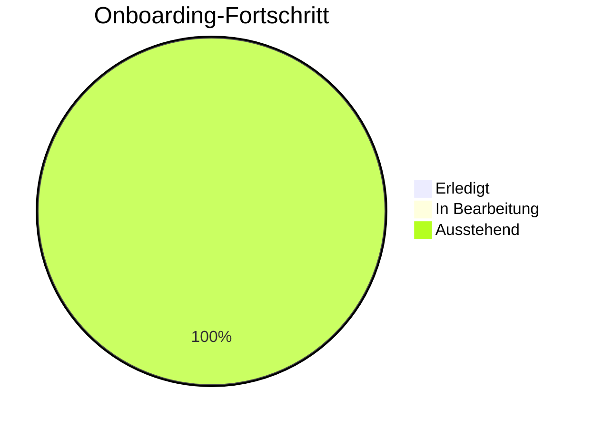

# 👋 Interaktiver Onboarding Guide

Willkommen im Team! Wir freuen uns, dass du da bist. Dieses interaktive Onboarding wird dir helfen, dich schnell einzuleben und produktiv zu werden.

## 🗺️ Deine Onboarding-Reise

📅 Tag 1: Ankommen & Kennenlernen

### Willkommen am ersten Tag!

- [ ] Zugangsdaten erhalten
- [ ] Laptop einrichten
- [ ] Team-Vorstellung
- [ ] Rundgang durch die wichtigsten Tools

**Ansprechpartner:** Maria (Team Lead)  
**Tipp:** Stelle viele Fragen - niemand erwartet, dass du alles sofort weißt!

📅 Tag 2-3: Technisches Setup

### Einrichtung deiner Entwicklungsumgebung

- [ ] Repository klonen
- [ ] Lokale Umgebung aufsetzen
- [ ] Erste Pipeline durchlaufen
- [ ] Mit Backstage vertraut machen

**Ansprechpartner:** Thomas (DevOps Engineer)  
**Ressourcen:** Siehe [Tools-Dokumentation](/tools)

📅 Woche 1: Erste Schritte im Projekt

### Erstes Eintauchen ins Projekt

- [ ] Code-Struktur verstehen
- [ ] Architekturübersicht bekommen
- [ ] Erste kleine Aufgabe übernehmen
- [ ] Erstes Code-Review durchführen

**Ansprechpartner:** Sophie (Senior Developer)  
**Tipp:** Beginne mit dem [Getting Started Guide](/getting-started)

📅 Monat 1: Projekt-Integration

### Vollständige Integration ins Team

- [ ] An Sprint-Planung teilnehmen
- [ ] Erste größere Features implementieren
- [ ] Feedback zum Onboarding geben
- [ ] Eigene Verbesserungsvorschläge einbringen

**Ansprechpartner:** Dein:e Mentor:in & Team Lead

## 🧩 Interaktive Lernressourcen

### Projektarchitektur erkunden

Klicke auf die Bereiche, die dich interessieren:

- [Frontend-Stack](#frontend) - React, TypeScript, Material UI
- [Backend-Stack](#backend) - Node.js, Express, PostgreSQL
- [Infrastruktur](#infrastruktur) - Kubernetes, Docker, AWS
- [CI/CD](#ci-cd) - GitHub Actions, ArgoCD

### Erforderliche Zugänge

| System       | Beantragen bei | Priorität |
|--------------|----------------|-----------|
| GitHub       | IT-Team        | Hoch      |
| Jira         | Team Lead      | Hoch      |
| Confluence   | Automatisch    | Mittel    |
| AWS Console  | DevOps Team    | Niedrig   |

## 📊 Dein Fortschritt

Vervollständige die Checklisten in den Abschnitten oben und verfolge deinen Fortschritt:

## 🙋 Fragen?

Zögere nicht, Fragen zu stellen! Wir helfen dir gerne weiter.

- Slack-Channel: #team-onboarding
- Wöchentliches Onboarding-Treffen: Freitags, 10:00 Uhr
- Dein:e persönliche:r Mentor:in: [Wird am ersten Tag zugewiesen]
