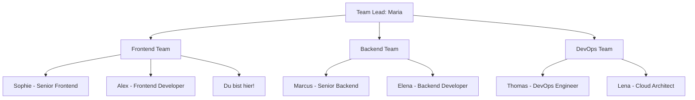

# 👥 Unser Team

Lerne die Menschen kennen, mit denen du zusammenarbeiten wirst!

## 🌟 Team-Struktur

## 👤 Ansprechpartner

Maria Schmidt - Team Lead

**Expertise:** Projektmanagement, Agile Methoden, Produktvision  
**Kontakt:** maria@example.com | Slack: @maria  
**Fun Fact:** War früher Konzertpianistin

Sophie Weber - Senior Frontend Developer

**Expertise:** React, TypeScript, UI/UX Design  
**Kontakt:** sophie@example.com | Slack: @sophie  
**Fun Fact:** Hält den Büro-Rekord im Tischkicker

Marcus Bauer - Senior Backend Developer

**Expertise:** Node.js, Microservices, Datenbanken  
**Kontakt:** marcus@example.com | Slack: @marcus  
**Fun Fact:** Braut sein eigenes Bier

Thomas Müller - DevOps Engineer

**Expertise:** Kubernetes, Docker, CI/CD Pipelines  
**Kontakt:** thomas@example.com | Slack: @thomas  
**Fun Fact:** Wandert gerne in den Alpen

## 🗓️ Regelmäßige Meetings

| Meeting         | Zeit              | Ort             | Wer               |
|-----------------|-------------------|-----------------|-------------------|
| Daily Stand-up  | Mo-Fr, 09:30 Uhr  | Raum Kreativ    | Alle              |
| Sprint Planning | Mo, 13:00 Uhr     | Raum Workshop   | Alle              |
| Retro           | Fr, 15:00 Uhr     | Raum Workshop   | Alle              |
| Tech Talk       | Mi, 16:00 Uhr     | Raum Innovation | Freiwillig        |

## 🤝 Mentoring-Programm

Als neues Teammitglied bekommst du eine:n persönliche:n Mentor:in zugewiesen, der/die dir in den ersten Monaten zur Seite steht.

### Was dein:e Mentor:in für dich tut:
- Regelmäßige 1:1 Gespräche
- Hilfe bei technischen Fragen
- Feedback zu deiner Arbeit
- Unterstützung bei der Integration ins Team

### Was du von deinem/deiner Mentor:in erwarten kannst:
- Offenheit für alle Fragen
- Ehrliches Feedback
- Unterstützung bei Herausforderungen
- Einführung in ungeschriebene Team-Regeln

## 🎯 Team-Werte

1. **Transparenz** - Wir kommunizieren offen und ehrlich
2. **Zusammenarbeit** - Wir arbeiten als Team, nicht als Einzelkämpfer
3. **Qualität** - Wir sind stolz auf unsere Arbeit
4. **Innovation** - Wir suchen ständig nach besseren Lösungen
5. **Work-Life-Balance** - Wir respektieren Freizeit und Privatleben
