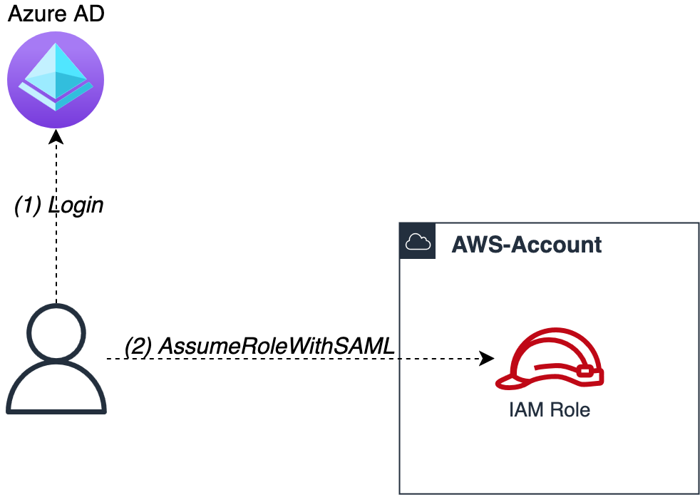
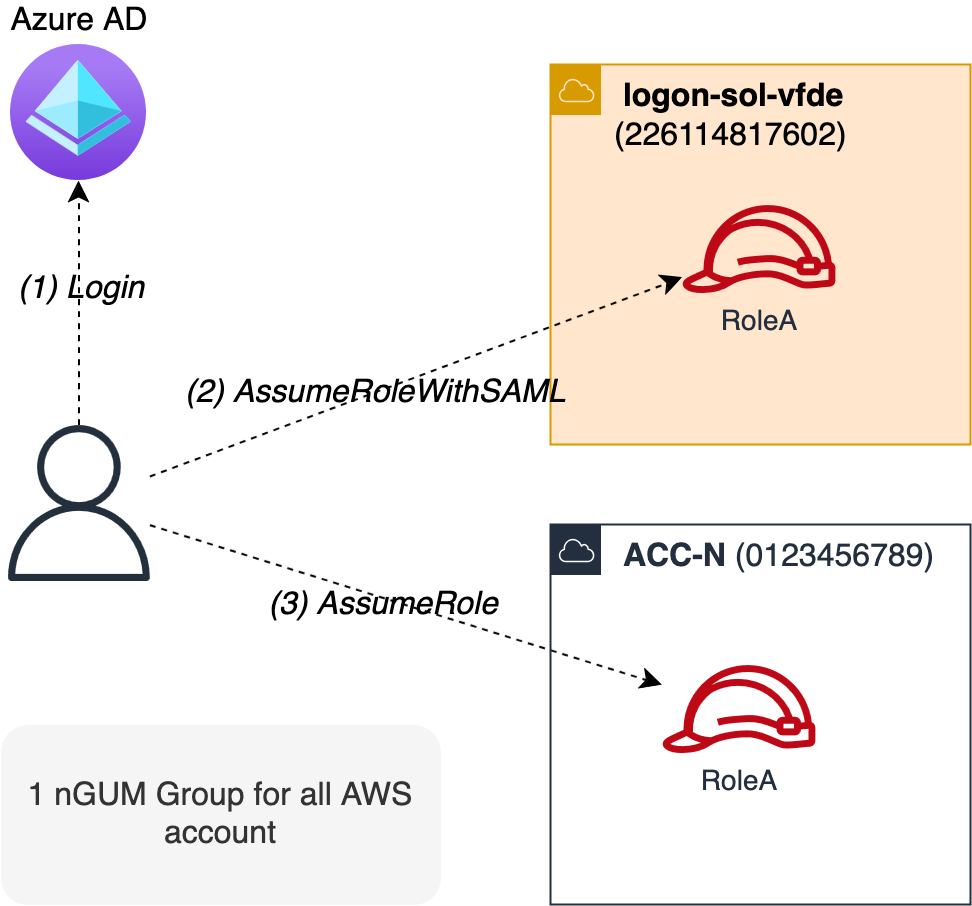
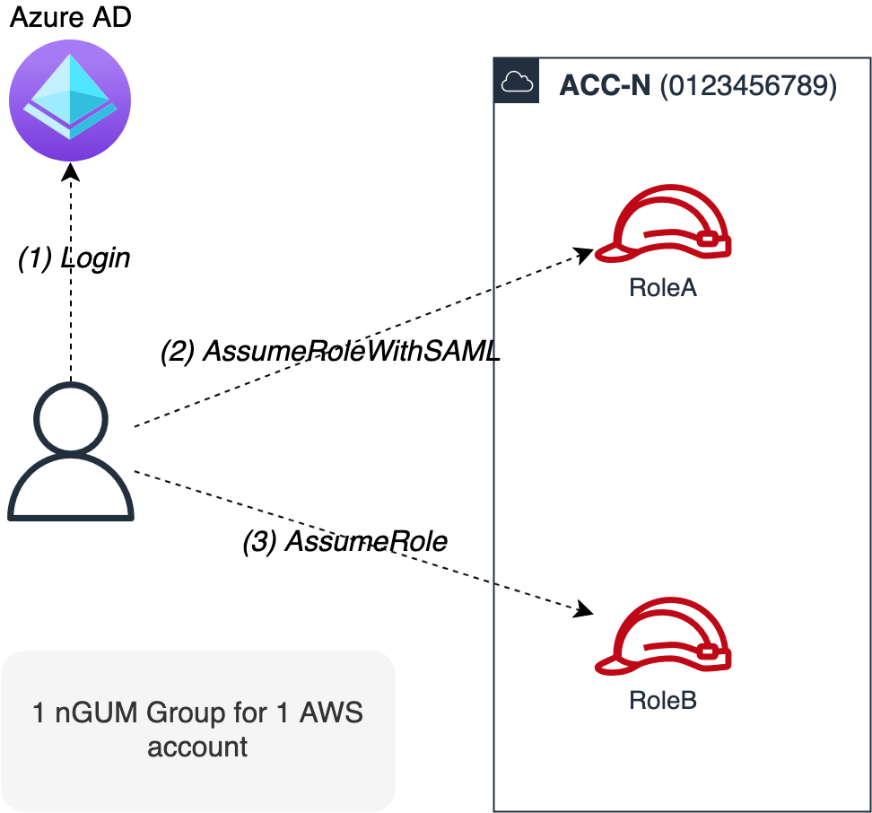

This section describes the flow for authenticating (_AuthN_) and authorizing (_AuthZ_) a user, who needs to interact with the AWS resources and Kubernetes (i.e. Amazon EKS ). A common scenario is: a DevOps maintaining the Infrastructure as Code of a FusionC project.

The process is valid independently of the use of a Web Browser or the Command Line Interface (CLI). It happens in the background, without the user performing any actions apart from the login process.

|  |
| :-------------------------------------------------: |
|           High level flow                           |


This document _does not cover_ AuthN/AuthZ at the application level, which is specific to the application itself. This responsibility ultimately remains with the development team.


### TL;DR

Every user interacting with AWS goes through this process in the background:

- login to the identity provider (IdP) Azure AD, using their corporate credentials
- assume a specific role in the AWS account (providing the SAML assertion response from the IdP as proof)
- assume another role in the same account or in another destination account

## Authentication (AuthN)

It is the process of verifying the identity of the users and confirming who they claim to be. Authentication is strictly performed by Vodafone's Azure AD. A user is asked to log in using the corporate credentials (1). This happens whenever accessing the [Azure AD page](https://myapps.microsoft.com/signin/78f5464b-e016-4fdb-9478-ba285b87fb8e?tenantId=68283f3b-8487-4c86-adb3-a5228f18b893) via web or using using [CAWS](https://github.vodafone.com/VFTech-SDaaS/Tool-caws) (indirectly [saml2aws](https://github.vodafone.com/VFTech-SDaaS/Tool-saml2aws)) via command line.

Upon a successful login, Azure AD returns a SAML assertion response. Using this response, the user will then perform an [_AssumeRoleWithSAML_](https://docs.aws.amazon.com/STS/latest/APIReference/API_AssumeRoleWithSAML.html) (2) towards AWS. If successful, AWS replies with a set of [temporary credentials](https://docs.aws.amazon.com/IAM/latest/UserGuide/id_credentials_temp.html), which are unique to the user's session and belonging to a specific IAM Role (e.g. RoleA).


This is only possible due to the [SAML federation](https://docs.aws.amazon.com/IAM/latest/UserGuide/id_roles_providers_saml.html), between Azure AD and AWS. The federation of the Identity Provider (IdP) allows verified users (i.e. from Azure AD) to interact with AWS resources through an IAM Role which trusts the IdP.


## Authorization (AuthZ)

Using the temporary credentials, the user can already interact with AWS resources. However, these temporary credentials belong to an IAM Role, federated with the Azure AD. These roles are often restricted or limited. A second AssumeRole is then needed to get the necessary

Depending on the user, one of the two scenarios depicted in the pictures applies:

- the central logon access - the first role is located in the AWS account called _logon-sol-vfde (id:226114817602)_. This account is the "logon" account, serving as the main AWS account federated with Azure AD and used as an intermediate step. _It has neither projects nor any resources in it._

    the second [AssumeRole](https://docs.aws.amazon.com/STS/latest/APIReference/API_AssumeRole.html) happens towards the target AWS account (3). It contains another distinct IAM Role to assume, but named the same as the role in _logon_. In this case, the temporary credentials (belonging to account:logon, role:RoleA) authenticate and authorize the user to assume RoleA in the target account, e.g. ACC-N (id: 0123456789)

|  |
| :-------------------------------------------------: |
|           Authz flow - central logon account 		  |

- per account access - the first role is already located in the destination AWS account belonging to the project. _It has read-only permission and at least the ability to assume another role withing that specific account._

    the second [AssumeRole](https://docs.aws.amazon.com/STS/latest/APIReference/API_AssumeRole.html) is performed towards another Role in _the same account_ (3). The temporary credentials (belonging to account:ACC-N, role:RoleA) authenticate and authorize the user to assume RoleB in the same account but having different permissions. This step is required when additional permissions other than RoleA is needed.

|  |
| :-------------------------------------------------: |
|           Authz - per account       			      |

Every successful AssumeRole returns a **new** set of temporary credentials. These belong to the specific IAM Role in the specific AWS account.

These last set of temporary credentials allows the user to interact with the AWS resources in AWS account ACC-N, which contains the project of interest and its associated resources.
