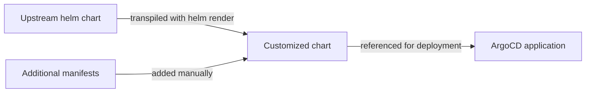
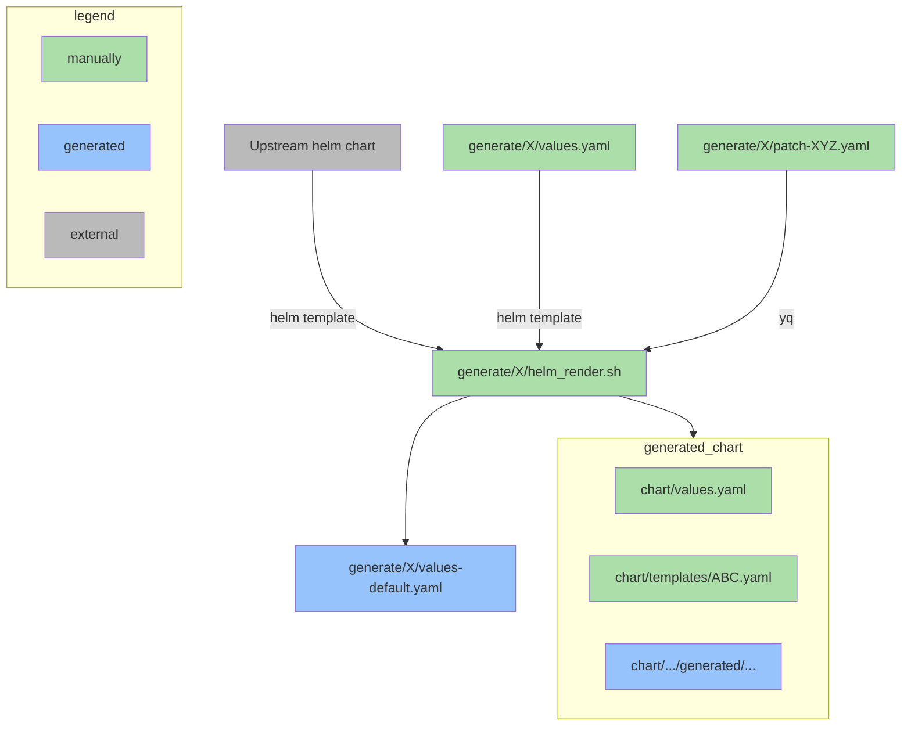

# Helm render: Creating helm charts based on helm charts

This article explains how to work on helm charts using the approach of *helm_render.sh*. Most of the charts in the k8s-modules repositories (e.g. [k8s-modules-sol](https://github.vodafone.com/VFDE-SOL/k8s-modules-sol), [k8s-modules-sol-fulfill](https://github.vodafone.com/VFDE-SOL/k8s-modules-sol-fulfill)) follow this process.



Our Istio charts use `istioctl` instead of `helm` to pull in the upstream chart. However, it's the same concept. For simplicity, we don't mention both binaries below. All content applies to `istioctl_render.sh`, too.


## The broad picture

Instead of writing charts manually or using *upstream* open-source charts directly, this approach adjusts upstream charts according to Solstice needs and offers new helm charts.



This is needed for a couple of reasons:
- Upstream charts offer lots of customization options that are not needed, even unwanted to keep different environments unified. This limits what can be customized.
- Sometimes, one needs changes to hard-coded parts of an upstream chart.
- Additional manifest files are needed frequently, e.g. network policies, Prometheus monitors, ingress management

# How a helm rendered chart looks like

This will be discussed with the [velero chart (v0.0.5)](https://github.vodafone.com/VFDE-SOL/k8s-modules-sol/tree/velero/v0.0.5/charts/velero) as an example. A cropped file tree:

```
 |-README.md
 |-generate
 | |-velero
 | | |-helm_get_latest_version.sh
 | | |-helm_render.sh
 | | |-patch-readiness-probe.yml
 | | |-values.yml
 | | |-patch-security-context.yml
 | | |-patch-dnsconfig.yml
 | | |-values-default.yml
 |-chart
 | |-templates
 | | |-velero-prometheus-rules.yml
 | | |-networkpolicy-ingress.yml
 | | |-velero
 | | | |-generated
 | | | | |-velero
 | | | | | |-templates
 | | | | | | |-[...]
 | |-crds
 | | |-velero
 | | | |-generated
 | | | | |-[...]
 | |-values.yaml
 | |-Chart.yaml
```

There are important directories and files to discuss:
- `generate/velero/helm_render.sh`: The bash script generating the files. This file is responsible for downloading the upstream chart, rendering (applying helm values) it and writing the result to the file system. The core step of this is that it applies values to the upstream chart the same way they are applied when installing a chart with helm directly. This leads to a chart with no more templating language and variables, so **upstream variables cannot be used in generated charts at all**.
- `generate/velero/values-default.yml`: This is the `values.yml` file of the upstream chart. It is downloaded and saved here during the script execution to have a quick research option and to have it in the git history which allows to track changes more easily.
- `generate/velero/values.yml`: This contains the values which are applied during the rendering step. It follows the usual process of customizing helm charts. Here, the upstream chart is customized to Solstice needs. The content will become hard-coded in the generated chart.
- `generate/velero/helm_get_latest_version.sh`: Optional, but available in most charts. This script checks the latest version on the upstream to see if updates are available.
- `generate/velero/patch-XYZ.yml`: These patch files are used to customize manifest parts that cannot be touched in `values.yml`. These are used with custom lines in `helm_render.sh` leveraging `yq` to merge YAML files after being rendered by helm, e.g.:
  ```bash
  yq m -i -a=update $generated_path/velero/templates/deployment.yaml ./patch-readiness-probe.yml
  ```
- `chart/`: The root repository of the generated chart. The target software can be installed with helm from here, also ArgoCD application will reference this directory.
- `chart/Chart.yaml`: The chart's metadata. Usually, the `appVersion` is automatically updated to match the upstream helm chart version.
- `chart/values.yaml`: This contains the default values of the chart. Other than `generate/velero/values.yml`, these values can be overridden per deployment.
- `chart/{templates,crds}/velero/generated/`: These directories contain `helm_render.sh`'s generated files. **Never work on these directly** as they will be overridden automatically. You must commit changes in these files together with the changes that causes them (`helm_render.sh`, `generate/x/values.yaml`).


There is a pre-commit hook checking that the generated files are in sync with the generate files. If it fails, run `helm_render.sh`, then `git status`. You must not have any changes in `generated`.


- `chart/templates/XYZ.yml`: These files are placed here manually and are only changed manually. Here, additional files like network policies are added. These files can contain templating language and e.g. use variables like `{{ .Values.abc }}` from `chart/values.yaml`.



## Re-adding variables
All `helm_render.sh` follow the same structure and use scripts from the *vfde-aws-cdk*. This included some chart post-processing to re-add variables to the generated manifests. Since this is based on simple string manipulation, one can add strings in `generate/velero/values.yml` or patch files which will be translated to variables at the end of the scripts.

### Primitive variables and releases
Add a string with the prefix `VALUES_` or `RELEASE_`, followed by the path of the variable you want to put. Nested values have to be written with underscores as separators:

| String input | Generated |
|-|-|
| VALUES_this | {{ .Values.this }} |
| VALUES_nested_val | {{ .Values.nested.val }} |
| RELEASE_Namespace | {{ .Release.Namespace }} |

### Complex objects (YAML)
This is used to reference not a primitive value, but dicts/maps and arrays/lists. These can be added with the prefix `SUBTREE_`, the path with underscores (same as with primitives) and a suffix of a dot `.` and an integer representing the number of spaces the value is indented with.

| String input | Generated |
|-|-|
| SUBTREE_container_resources.12 | {{- toYaml .Values.container.resources \| nindent 12 }} |

Choosing the correct indentation is not trivial. The number has to be chosen based on where the templating expression will be placed. For instance, the velero resources are located in `chart/templates/velero/generated/velero/templates/deployment.yaml`:

```yaml
spec:
  template:
    spec:
      containers:
        - name: velero
          resources: {{- toYaml .Values.velero.resources | nindent 12 }}
#<12 spaces>requests: ...
```

The indentation of 12 spaces matches 6 levels of indentation required for the object, each represented by 2 spaces. It is important to note that this only depends on the generated charts, never on any `values.yaml` (including `values-default.yaml`). Remember that the content of on object does not include the object name itself. In this case, the 12 spaces are the indentation of the `requests`/`limits` keyword within `resources`, not of `resources` itself.

### JSON objects
To transform a (complex) variable to a JSON string, the prefix `JSON_` can be used:

| String input | Generated |
|-|-|
| JSON_foo_bar | {{ toJson .Values.foo.bar }} |

### Indented values
To add special indentation, the prefix `VALUESINDENT_` can be used. This follows the same indentation logic as `SUBTREE`, but sets a default empty string to prevent YAML errors.

| String input | Generated |
|-|-|
| VALUESINDENT_this.4 | {{ default "" .Values.this \| nindent 4 }} |

Run `less $(which helm_fix_templating_fruity.sh)` to see the exact implementation of these string manipulations.

## Patching generated files
The intended way to manipulate hard-coded manifest contents of the upstream chart is to leveage `yq` after the `helm template` step in `helm_values.yml`. The developer workspaces all have **yq version 3** installed, **not the latest one (v4)**. Copy from an existing script in another chart or read the [official yq v3 docs](https://mikefarah.gitbook.io/yq/v/v3.x/) for details. For small changes, directly writing to the file is sufficient. For larger adjustments, extra patch files are added and then merged into the target file.

## pre-commit hook
To ensure consistency, there is a custom pre-commit hook. When configured, it runs locally depending on changed files and for all files on each PR as a GitHub Action. It searches for files called `helm_render.sh` in the directory structure present in all k8s module repositories. Generated files have to be ignored by conflicting hooks, e.g. if the upstream chart has trailing whitespaces in a line, they will be rendered to the generated files as well. For a working setup, see [k8s-modules-sol](https://github.vodafone.com/VFDE-SOL/k8s-modules-sol/blob/velero/v0.0.5/.pre-commit-config.yaml)

```yaml
repos:
- repo: https://github.vodafone.com/VFDE-CloudFramework/pre-commit-hooks
    rev: v0.0.8
    hooks:
    - id: helm_render_check
```

## Must know

- The difference between `generate/velero/values.yml` and `chart/values.yaml`

    | `generate/velero/values.yml` | `chart/values.yaml` |
    |-|-|
    | fits values of the upstream charts | fit values of the generated chart |
    | cannot be overridden per deployment | can be overridden per deployment |
    | may contain string placeholder that will be translated to template language | must not contain string placeholders, those would be interpreted as string literals |

- Master branch charts are always compliant to this approach, meaning no manual changes of generated files will ever be merged
- Never set fixed resource requests/limits, always use `SUBTREE` and set useful defaults in `chart/values.yaml`
- The indentation for `SUBTREE` or `VALUESINDENT` depends on generated files, not any `values.yaml`/`values-default.yaml`
- Customization options of upstream charts are not available in generated charts unless specified explicitly.

## Additional resources

- [Customizing a helm chart](https://helm.sh/docs/intro/using_helm/#customizing-the-chart-before-installing)
- [Template functions available in helm manifests](https://helm.sh/docs/chart_template_guide/functions_and_pipelines/#helm)
