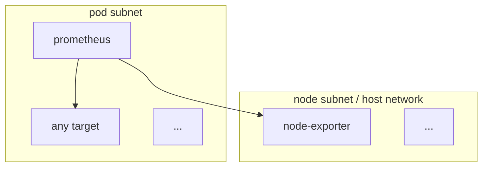

{}
This requires terraform cet-eks version v0.2.0-1 or above
{}

## Example

Take prometheus as example: A prometheus instance is located in a pod subnet. Some targets, here a prometheus node exporter pod, are running on the host network, thus in a node subnet.

To allow this communication, the specific target port has to be allowlisted as a security group rule. Non-allowlisted ports cause a request timeout (so prometheus targets appear as down).

## Configuration

The Solstice CET-EKS instances come with pre-configured allowlisted ports for

- prometheus-node-exporter
- cilium (agent and operator)
- hubble
- kubelet

Additional ports can be configured in the terraform project. Open the `terragrunt.hcl` for `platform/cet_eks`. In the input section, add or adjust the optional variable `additional_pod_to_host_ports` (list of numbers).


Go to the terraform module

