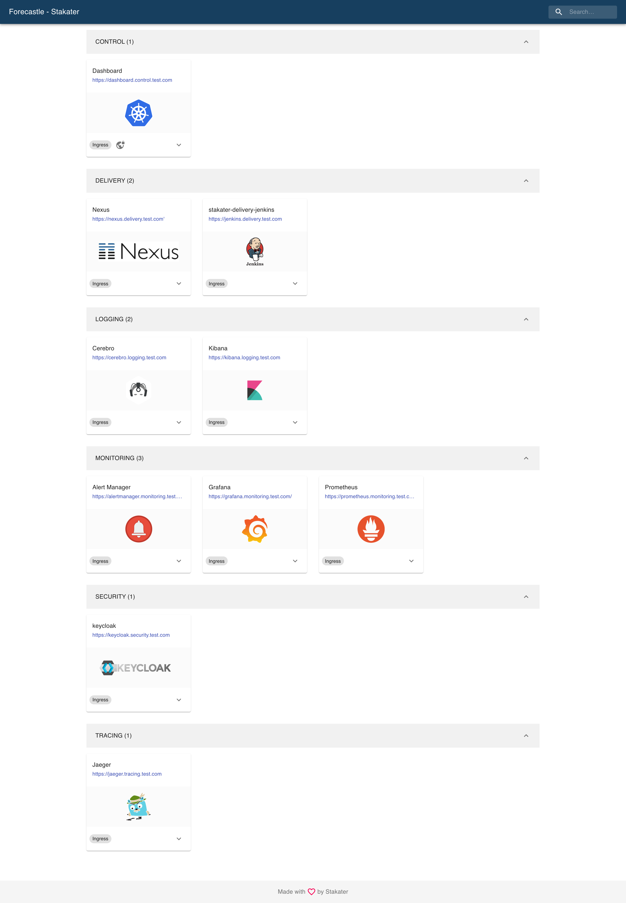

# Portal

## Problem

- Finding and accessing applications on Kubernetes can be challenging without a central hub.
- It's essential to have a dynamic way to discover and list applications that are actively running on Kubernetes.
- Developers often need a streamlined portal to access essential tools like Jenkins, Nexus, Kibana, Grafana, and others.

## Solution

[Forecastle](https://github.com/stakater/forecastle) gives you access to a control panel where you can see your running applications and access them on Kubernetes.

Forecastle provides a unified control panel, serving as a convenient gateway to view and access your applications deployed on Kubernetes. Whether it's monitoring tools, CI/CD pipelines, or other applications, Forecastle brings them all to your fingertips in one central location.



## How to Add an Application

Forecastle uses a specific CRD `ForecastleApp`. Resources of this kind have to exist in the `forecastle` namespace to be auto-discovered and added to the portal. There are two ways to do this. They both require the following information:

- **name**: The display name, will be shown in the UI.
- **group**: Links are grouped. Provide any group name. It is created automatically if it doesn't exist yet.
- **icon**: The UI image/icon of your link. This is a Link, you cannot host it via Forecastle. Make sure it is accessible from everywhere (no auth or network restrictions).
- **url**: The URL to navigate to.
- **networkRestricted**: If `true`, this adds a small icon to indicate that this is not publicly available, but has some kind of restriction.

**Add it to an application's helm chart**

Simply add the custom resource to your chart:

```yaml
apiVersion: forecastle.stakater.com/v1alpha1
kind: ForecastleApp
metadata:
  name: my-app-in-forecastle
   # the namespace needs to be fixed
   # so you can deploy your app in any namespace,
   # but this is always in the forecastle namespace
  namespace: forecastle
spec:
  name: "my app"
  group: Applications
  icon: "https://..."
  url: "https://..."
  networkRestricted: true
```

**Use the separate chart**

In case you don't want to or you cannot add it to your existing chart, you can use Tesla's [*forecastleapps*](https://github.vodafone.com/VFDE-SOL/k8s-modules-sol/tree/master/charts/forecastleapps) chart.

```yaml
apiVersion: argoproj.io/v1alpha1
kind: Application
metadata:
  name: "my-forecastleapps"
  finalizers:
    - resources-finalizer.argocd.argoproj.io
spec:
  destination:
    namespace: forecastle
    server: "{{ .Values.eks.server }}"
  project: "target"
  source:
    path: charts/forecastleapps/chart
    repoURL: "https://github.vodafone.com/VFDE-SOL/k8s-modules-sol"
    targetRevision: forecastleapps/v1.0.0 # check if newer exists
    helm:
      values: |
        forecastleApps:
          - name: My App A
            group: Applications
            icon: https://...
            url: https://...
            networkRestricted: true
          - name: My App B
            group: Applications
            icon: https://...
            url: https://...
            networkRestricted: false
  syncPolicy:
    automated:
      prune: true
      selfHeal: true
```

## Portal Deployments

By default, Forecastle is deployed to all EKS clusters. There's one **exception**: Accounts that only have non-EKS workloads, in which the EKS only exists for the observability stack, don't get forecastle by default.

If forecastle is needed somewhere, reach out to Tesla team or deploy it yourself with [Tesla's forecastle charts](https://github.vodafone.com/VFDE-SOL/k8s-modules-sol/tree/master/charts/forecastle) and add ingress.

The default pattern to find the url of the portal is `https://portal.<SHORT_ALIAS_DOTTED>.pub.sol-vf.de`, with `<SHORT_ALIAS_DOTTED>` being replaced by the account's short alias with dots instead of hyphens (e.g. `dev.staging.done` instead of `dev-staging-done`).

| Project  | Account Short Alias | Portal |
|----------|---|---|
| afms     | dev-afms | [https://portal.dev.afms.pub.sol-vf.de](https://portal.dev.afms.pub.sol-vf.de) |
|          | pref-afms | [https://portal.pref.afms.pub.sol-vf.de](https://portal.pref.afms.pub.sol-vf.de) |
|          | prod-afms | [https://portal.prod.afms.pub.sol-vf.de](https://portal.prod.afms.pub.sol-vf.de) |
|          | test-afms | [https://portal.test.afms.pub.sol-vf.de](https://portal.test.afms.pub.sol-vf.de) |
| asgw     | dev-asgw | [https://portal.dev.asgw.pub.sol-vf.de](https://portal.dev.asgw.pub.sol-vf.de) |
|          | pref-asgw | [https://portal.pref.asgw.pub.sol-vf.de](https://portal.pref.asgw.pub.sol-vf.de) |
|          | prod-asgw | [https://portal.prod.asgw.pub.sol-vf.de](https://portal.prod.asgw.pub.sol-vf.de) |
|          | test-asgw | [https://portal.test.asgw.pub.sol-vf.de](https://portal.test.asgw.pub.sol-vf.de) |
| atc      | dev-atc | [https://portal.dev.atc.pub.sol-vf.de](https://portal.dev.atc.pub.sol-vf.de) |
|          | pref-atc | [https://portal.pref.atc.pub.sol-vf.de](https://portal.pref.atc.pub.sol-vf.de) |
|          | prod-atc | [https://portal.prod.atc.pub.sol-vf.de](https://portal.prod.atc.pub.sol-vf.de) |
|          | sbox-atc | [https://portal.sbox.atc.pub.sol-vf.de](https://portal.sbox.atc.pub.sol-vf.de) |
|          | test-atc | [https://portal.test.atc.pub.sol-vf.de](https://portal.test.atc.pub.sol-vf.de) |
| cicdhub  | dev-cicdhub | [https://portal.dev.cicdhub.pub.sol-vf.de](https://portal.dev.cicdhub.pub.sol-vf.de) |
|          | prod-cicdhub | [https://portal.prod.cicdhub.pub.sol-vf.de](https://portal.prod.cicdhub.pub.sol-vf.de) |
| cim      | dev-cim | [https://portal.dev.cim.pub.sol-vf.de](https://portal.dev.cim.pub.sol-vf.de) |
|          | sbox-cim | [https://portal.sbox.cim.pub.sol-vf.de](https://portal.sbox.cim.pub.sol-vf.de) |
| cone     | dev-cone | [https://portal.dev.cone.pub.sol-vf.de](https://portal.dev.cone.pub.sol-vf.de) |
|          | prod-cone | [https://portal.prod.cone.pub.sol-vf.de](https://portal.prod.cone.pub.sol-vf.de) |
| done     | dev-staging-done | [https://portal.dev.staging-done.pub.sol-vf.de](https://portal.dev.staging-done.pub.sol-vf.de) |
|          | int-done | [https://portal.int.done.pub.sol-vf.de](https://portal.int.done.pub.sol-vf.de) |
|          | pref-done | [https://portal.pref.done.pub.sol-vf.de](https://portal.pref.done.pub.sol-vf.de) |
|          | preprod-done | [https://portal.preprod.done.pub.sol-vf.de](https://portal.preprod.done.pub.sol-vf.de) |
|          | prod-done | [https://portal.prod.done.pub.sol-vf.de](https://portal.prod.done.pub.sol-vf.de) |
|          | prod-mig-done | [https://portal.prod.mig-done.pub.sol-vf.de](https://portal.prod.mig-done.pub.sol-vf.de) |
|          | test-done | [https://portal.test.done.pub.sol-vf.de](https://portal.test.done.pub.sol-vf.de) |
|          | test-mig-done | [https://portal.test.mig-done.pub.sol-vf.de](https://portal.test.mig-done.pub.sol-vf.de) |
| fulfill  | dev-fulfill | [https://portal.dev.fulfill.pub.sol-vf.de](https://portal.dev.fulfill.pub.sol-vf.de) |
|          | pref-fulfill | [https://portal.pref.fulfill.pub.sol-vf.de](https://portal.pref.fulfill.pub.sol-vf.de) |
|          | preprod-fulfill | [https://portal.preprod.fulfill.pub.sol-vf.de](https://portal.preprod.fulfill.pub.sol-vf.de) |
|          | prod-fulfill | [https://portal.prod.fulfill.pub.sol-vf.de](https://portal.prod.fulfill.pub.sol-vf.de) |
|          | prod-mig-fulfill | [https://portal.prod.mig-fulfill.pub.sol-vf.de](https://portal.prod.mig-fulfill.pub.sol-vf.de) |
|          | test-fulfill | [https://portal.test.fulfill.pub.sol-vf.de](https://portal.test.fulfill.pub.sol-vf.de) |
|          | test-mig-fulfill | [https://portal.test.mig-fulfill.pub.sol-vf.de](https://portal.test.mig-fulfill.pub.sol-vf.de) |
| (Tesla)  | dev | [https://portal.dev.pub.sol-vf.de](https://portal.dev.pub.sol-vf.de) |
|          | dev1 | [https://portal.dev1.pub.sol-vf.de](https://portal.dev1.pub.sol-vf.de) |
|          | mgmt | [https://portal.mgmt.pub.sol-vf.de](https://portal.mgmt.pub.sol-vf.de) |
|          | sbox1-vfcf | [https://portal.sbox1.vfcf.pub.sol-vf.de](https://portal.sbox1.vfcf.pub.sol-vf.de) |
|          | sbox2-vfcf | [https://portal.sbox2.vfcf.pub.sol-vf.de](https://portal.sbox2.vfcf.pub.sol-vf.de) |
