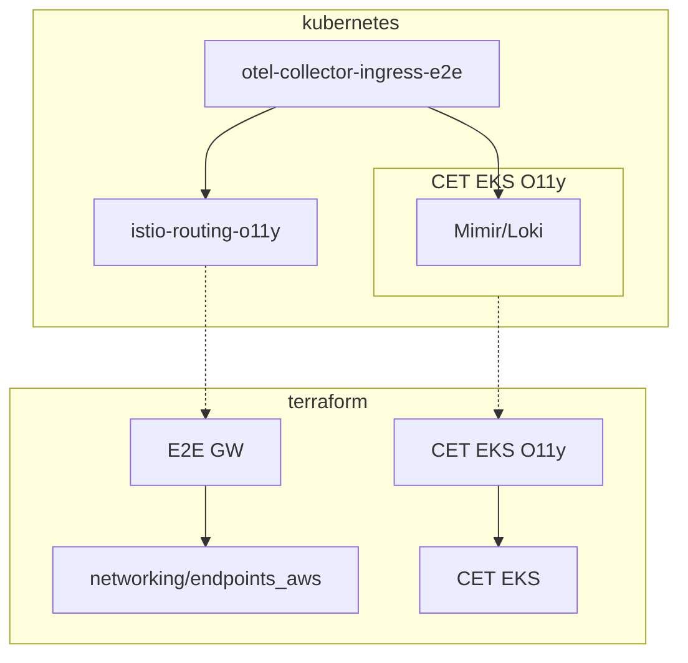
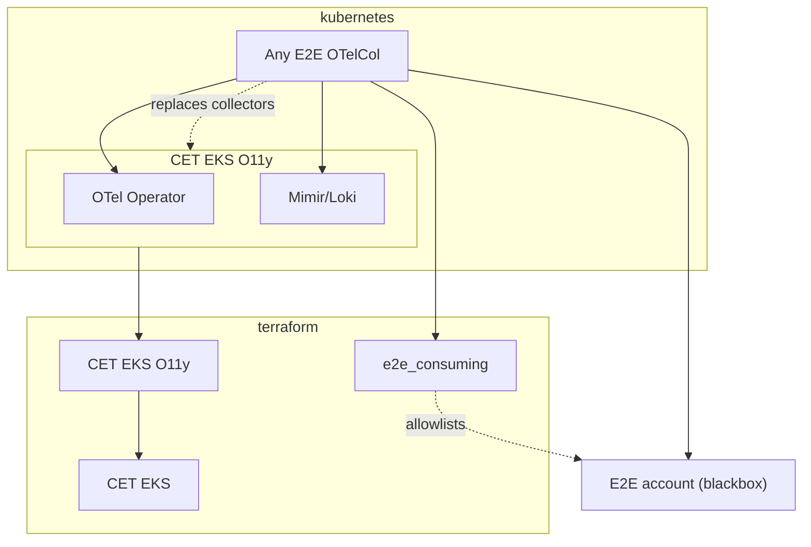
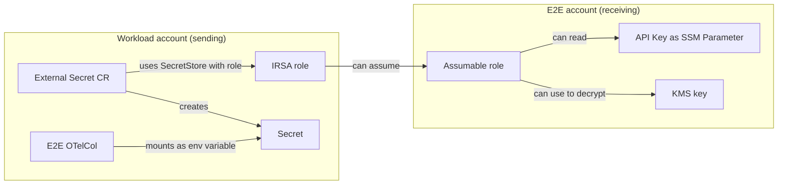

## Introduction and Goals

After moving from Datadog to Grafana, observability is focused on monitoring contents of one AWS account. E2E O11y is the solution to bring back cross-account monitoring capabilities, so business processed can be observed end to end.

Enablers:
- [SOLSOLU-3312 | Move Application Monitoring from Datadog to Open Source Solution](https://de.jira.agile.vodafone.com/browse/SOLSOLU-3312)
- [SOLSOLU-3315 | Determine concept and PoC of E2E monitoring with O11y](https://de.jira.agile.vodafone.com/browse/SOLSOLU-3315)

## Context and Scope

The E2E Observability solution enables cross-account monitoring of business workflows like customer orders and invoicing, replacing the cross-account monitoring capabilities previously available in Datadog.

### System Boundary

The E2E Observability system aggregates, filters, and stores business-critical metrics and logs from:

- CET AWS accounts with EKS O11y installed (supporting both EKS and non-EKS workloads)
- Other AWS accounts within Vodafone
- On-prem applications in Vodafone data centers *(under discussion)*

The system interfaces with applications through:
- OpenTelemetry Protocol (OTLP) over HTTP/HTTPS
- AWS PrivateLink for secure cross-account communication
- AWS API Gateway for authentication and traffic management

Data collection is opt-in, with each source explicitly configured to send specific metrics and logs to E2E.

## Solution Strategy

- Deploy a distinct (staged) E2E project for data aggregation
- Keep O11y per account
  - Less cross-account traffic
  - No single point of failure
  - Separation of concerns, as there's no RBAC in OSS Grafana
- Send specific O11y data from workload accounts to an E2E account by explicit opt-in

## Building Block View

These sections describe the composition of both the sending (workload accounds) and receiving (E2E accounts) side. Each block is a deployable artifact, either a Helm chart or a terraform module. For simplicity, the most basic elements (e.g. k8s: CET EKS systemapps, tf: VPC, DNS) are left out.

### Receiving Side

- Terraform
  - [E2E-GW](https://github.vodafone.com/VFDE-SOL/terraform-modules-sol-e2e/tree/master/modules/e2e_gateway): Deploys connectivity resources (API gateways, load balancers, ...) incl. API key management
  - [CET EKS](https://github.vodafone.com/VFDE-ISS/cet-eks): Deploys a EKS cluster
  - [CET EKS O11y](https://github.vodafone.com/VFDE-ISS/cet-eks-o11y): Deploys the O11y stack
- Kubernetes
  - [OTelCol Ingress E2E](https://github.vodafone.com/VFDE-SOL/k8s-modules-sol-e2e/tree/master/charts/otel-collector-ingress-e2e): Deploys the OTelCol to accept and validate incoming data
  - [istio-routing (ingress gateway)](https://github.vodafone.com/VFDE-SOL/k8s-modules-sol/tree/master/charts/istio-routing): Deploys the IGW to be registered as listener target
  - [CET EKS](https://github.vodafone.com/VFDE-ISS/cet-eks): Deploys base EKS applications, e.g. AWS LB Controller
  - [CET EKS O11y](https://github.vodafone.com/VFDE-ISS/cet-eks-o11y): Deploys the O11y stack

### Sending side

The sending side is categorized into three distinct use cases:

 ##### **1. CET Accounts**

- Terraform
  - [e2e_consuming](https://github.vodafone.com/VFDE-SOL/terraform-modules-sol-e2e/tree/master/modules/e2e_gateway/extra/e2e_consuming): Establishes network connectivity (PrivateLink) and IAM permissions to access the E2E account
  - [CET EKS](https://github.vodafone.com/VFDE-ISS/cet-eks): Deploys an EKS cluster
  - [CET EKS O11y](https://github.vodafone.com/VFDE-ISS/cet-eks-o11y): Deploys the O11y stack
- Kubernetes
  - E2E OTelCols
    - [OTelCol E2E for in-cluster metrics](https://github.vodafone.com/VFDE-SOL/k8s-modules-sol-e2e/tree/master/charts/otel-collector-k8s-metrics): Deploys OTelCols sending metrics to both the local O11y stack and the E2E account
    - [OTelCol E2E for in-cluster logs](https://github.vodafone.com/VFDE-SOL/k8s-modules-sol-e2e/tree/master/charts/otel-collector-k8s-logs):  Deploys OTelCols sending logs to both the local O11y stack and the E2E account
  - [CET EKS O11y](https://github.vodafone.com/VFDE-ISS/cet-eks-o11y): Deploys the O11y stack

##### **2. Landing Zone Accounts**

-   Engineers managing Landing Zone accounts must:
    -   Pull the required [API key](#api-key-distribution).
     - Assign [execute permissions](#authentication) for their setup.

##### **3. On-Prem Applications**

-   Key tasks include:
    -   Setting up IAM roles for authentication.
    -   Configuring network connectivity to the E2E account.
-   Volunteers are welcome to contribute to defining the approach.

## Runtime View

#### Traffic Flow

The diagram below shows the traffic flow from an application on the sending side to the O11y stack in the receiving side. The observed application is treated as a blackbox, as it is highly individual. This can be the E2E collectors provided for CET clusters, or any other software sending data over OTLP via HTTP. The data is transmitted securely over HTTPS (TLS encryption) using port 443, as enforced by API Gateway for incoming traffic.

The E2E setup supports three traffic flow cases. Workloads in an AWS account can either use an established PrivateLink connection to send traffic over AWS-only networks, or use the public route. Workloads outside of AWS must use the public route. The PrivateLink connection is optional. From an AWS account perspective, the public and private endpoints have different domains and can be addressed separately.

**Private Route**

- The application sends data to the PrivateLink VPC endpoint (TLS-encrypted, port 443, SigV4-signed, with API key)
- The NLB backing the VPC endpoint terminates TLS, re-encrypts and routes the traffic to the private API Gateway
- The API Gateway matches the incoming traffic with a greedy wildcard
- The API Gateway uses the IAM Authorizer to validate the sender
- The API Gateway uses the API key to match a usage plan and eventually throttles the traffic
- The API Gateway re-encrypts and forwards the traffic to the second NLB. It this changes the destination (host and port)
- The second NLB re-encrypts and routes the traffic to the in-cluster ingress gateway pods which are registered as listener targets
- In-cluster traffic management routes the traffic to the OTelCol to validate the data sent
- The validation OTelCol forwards the data to the respective storage system (part of the O11y stack)

**Public Route**

- The application sends data to the public endpoint (TLS-encrypted, port 443, SigV4-signed, with API key)
- The Web Application Firewall (AWS) assesses the traffic and routes it to the public API Gateway
- The public API Gateway does the same as the private API Gateway does (IAM Autorizer, usage plan)
- The API Gateway forwards the traffic to the same NLB. From there, the traffic follows the identical path as explained above

#### Authentication

Every request sent to any E2E endpoint must be with a [SigV4 signature](https://docs.aws.amazon.com/AmazonS3/latest/API/sig-v4-authenticating-requests.html). The signature is validated by the API Gateways' IAM Authorizer. The requests must be signed with a principal from a workload account which is onboarded to the respective E2E account. Further, the signing role must have the `execute-api:Invoke` permission for the API Gateway.

OpenTelemetry Collectors can use the [`sigv4authextention`](https://github.com/open-telemetry/opentelemetry-collector-contrib/tree/main/extension/sigv4authextension). The provided E2E collectors implement this feature.

#### API Key Distribution

API keys are created from the *e2e-gw* terraform component inside of the E2E account. Alongside the SSM parameter exposing the key, a assumable role is created with the minimum privileges to read an account's specific API key and use the respective KMS key to decrypt it. The sending side must fetch the key and incorporate it in their application(s). Both the public and private API Gateways use the same API key and usage plan.

For CET EKS clusters, this is delivered out of the box with the *e2e-consuming* terraform module and E2E OTelCol Helm charts:

Custom applications can use a similar approach to obtain the relevant API key, e.g. from EC2 instances' User Data. The aforementioned role in the E2E is assumable by every principal of the respective AWS account.


API keys are not rotated. Applications are not required to react on a API key change.



As there is no on-prem system yet, there is no finalized setup for authentication and API key distribution.


## Cross-cutting Concepts

#### Authentication & Authorization

The least privilege principle applies, as workload accounts are treated as blackbox. To provide their service, E2E accounts only allow distinct scenarios to workload accounts:

- Read the API key from SSM parameters (accounts are allowed on their own account only)
- Invoke the API Gateway (send requests to it)

The E2E accounts set up the respective IAM roles' trust policies and to allow all principals of onboarded accounts.

The E2E accounts have the capability to cut authentication and connectivity to individual workload accounts without dependency.

#### SigV4 Authentication To The API Gateway's IAM Authorizer


API keys are not used for authentication. They are not cryptically signed, they must have a long lifetime and can be stolen. AWS does not natively support API key rotation for a reason.

>**Important** \
Don't use API keys for authentication or authorization to control access to your APIs. If you have multiple APIs in a usage plan, a user with a valid API key for one API in that usage plan can access all APIs in that usage plan. Instead, to control access to your API, use an IAM role, a Lambda authorizer, or an Amazon Cognito user pool.

From [*Best practices for API keys and usage plans* (AWS docs on Oct 22, 2024)](https://docs.aws.amazon.com/apigateway/latest/developerguide/api-gateway-api-usage-plans.html#apigateway-usage-plans-best-practices)


At least for public access, there must be authentication. The main technical constraint is the OTelCol and its capabilities. The [`sigv4authextention`](https://github.com/open-telemetry/opentelemetry-collector-contrib/tree/main/extension/sigv4authextension) can be used to authenticate OTelCols to AWS API Gateway [IAM authorizers](https://docs.aws.amazon.com/apigateway/latest/developerguide/http-api-access-control-iam.html) by using [SigV4 signatures](https://docs.aws.amazon.com/AmazonS3/latest/API/sig-v4-authenticating-requests.html). To not distinguish between private and public on the sending side, the private API Gateway also requires authentication.


As there is no on-prem system yet, there is no finalized setup for authentication and API key distribution.


#### API Keys & Usage Plans

Sending accounts are identified by API keys. All principals of one account use the same API key - the receiving side does not distinguish between apps in one account. All traffic restrictions are shared across one account.


To set a proper default for the usage plan limitations, experience with onboarded accounts and their data is needed. Everything is prepared to put proper limits and is to be changed at a later point in time, without further notice.


API keys are accessible from the E2E accounts as explained in the [runtime view](https://github.vodafone.com/VFDE-ISS/cet-eks-o11y/pull/316).

#### LGTM Stack Tenant Management

The O11y storage systems Mimir, Loki and Tempo are configured to support multi-tenancy. Pushing data requires to set a HTTP header which contains the target tenant. The validation OTelCol shields the storage systems from the HTTP header coming from the sending side, and adds its own. With this, E2E accounts have total control over storage tenancy. It also adds the restriction that all data is exported to the same tenant.

#### Input validation

The E2E accounts deploy a validation OTelCol to analyze and drop bad data. Current validation rule are:

- `source.name` metadata required - For the identification of data when querying and for proper partitioning, all data without a `source.name` identifier is dropped.
  - Metrics: datapoint attribute
  - Logs: resource attribute

## Architecture Decisions

<table class="decision"><thead>
  <tr>
    <th>Authentication via SigV4 signatures</th>
    <th class="nowrap">Oct 18, 2024</th>
  </tr></thead>
<tbody>
  <tr>
    <td colspan="2">
      We agreed to not use API keys for auth as it's bad practice and would have severe implications: We would need a rotation mechanism (AWS does not support it out of the box), we would need apps to support hot-reload or it means service interruptions.
       
       
      We tried using OTelCol's <a href="https://github.com/open-telemetry/opentelemetry-collector-contrib/tree/main/extension/awsproxy" target=_blank><code>awsproxy</code></a> extension but found it to be immature and focusing on AWS services rather than arbitrary endpoints with IAM auth.
       
       
      Based on available solutions for OTelCol, we decided to go with <a href="https://github.com/open-telemetry/opentelemetry-collector-contrib/tree/main/extension/sigv4authextension" target=_blank><code>sigv4authextension</code></a>, as we prioritized to deliver something out of the box rather than leaving the teams on their own.
    </td>
  </tr>
    <td colspan="2" class="involved">Alessio, Mikel</td>
  </tr>
</tbody>
</table>

<table class="decision"><thead>
  <tr>
    <th>Expose API key as SSM Parameter instead of SecretsManager</th>
    <th class="nowrap">Oct 18, 2024</th>
  </tr></thead>
<tbody>
  <tr>
    <td colspan="2">
      Using SecretsManager would be the obvious choice, as it is already included in the terraform-component-apigateway. Yet we cannot use it, as we want to use the same API key for both public and private API Gateway, which is not supported.
       
       
      <strong>Downsides of SSM param:</strong> Has no resource policy, so it forces us to create assumable roles (advanced parameters' resource policies does not fit).
       
      <strong>Downsides of SecretsManager:</strong> Automatically adds a suffix to each secret/ARN, so we must have manual copy paste (terragrunt dependencies across projects/repos does not work) and we would not be able to redeploy resources on E2E side, as the suffix would change. Costs more than SSM Params.
       
       
      We chose SSM over SecretsManager as it's our usual go-to, we have clear namings without random suffixes and for lower costs.
    </td>
  </tr>
    <td colspan="2" class="involved">Alessio, Mikel</td>
  </tr>
</tbody>
</table>

## Risks and Technical Debts

### Risks

- E2E account as single point of failure <i class="fa-solid fa-arrow-right"></i> Keep local O11y stack for the per-account monitoring effort
- Cross-account implications <i class="fa-solid fa-arrow-right"></i> Use usage plans to throttle accounts instead of allowing single accounts to DoS the E2E account for everyone

### Limitations

- Grafana OSS does not provide RBAC capabilities, meaning everyone can see everything. It was the same with Datadog though.
- Storage scaling is unknown. As O11y provides a fixed number of ingesters etc., it's unknown how much data the E2E accounts can handle. Traffic throttling applies, and teams must not dump all their data.
- Indexing in Loki is limited to 15 labels at max. This is shared across all accounts for E2E accounts.
