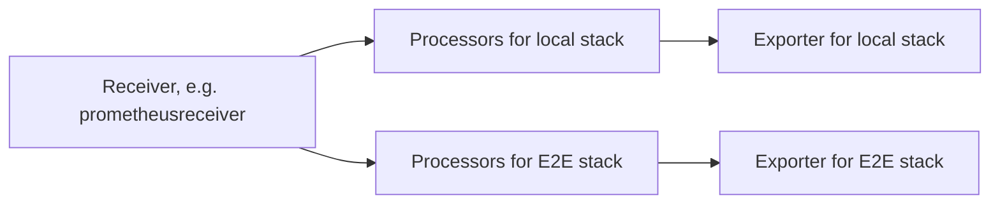

## Second Pipeline

To send data to both the local and an E2E O11y stack, a second pipeline is needed. Both pipelines must start with the same receiver instance (to not duplicate data collection), can use arbitrary processors and then must use different exporter instances.

{}
Remember: OTelCol building blocks can be instantiated multiple times by naming them. Example: `otlphtp`, `otlphttp/local` and `otlphttp/e2e` are three instances of the same exporter, which can have different configuration (such as the endpoint). This is also true for pipelines, e.g. `metrics` and `metrics/e2e`.
{}




A basic second pipeline config looks like below. `encoding: json` is needed as the default encoding is `protbuf` which is not supported by the API Gateway.

```yaml
exporters:
  otlphttp/e2e:
    endpoint: "{{ .Values.config.e2e.endpoint }}"
    encoding: json
service:
  pipelines:
    logs: # the config of the local stack pipeline
    logs/e2e:
      receivers: [...] # should be identical to the local stack pipeline
      processors: [...]
      exporters: [otlphttp/e2e]
```

{}
OpenTelemetry Collector v0.80 is known to not work with this configuration, as the `otlphttp` exporter is outdated. v0.99 is known to work. It is recommended to use up-to-date collector versions.
{}

## Adding The `source_name` Label

To identify from where observability data has been sent, an additional label `source_name` is required. This can be added statically by the OpenTelemetry Collector with processors:

**For metrics**
The `source_name` label has to be added as a *datapoint* attribute as follows:

```yaml
processors:
  attributes/e2e: # when using resource processor, the source_name label is not propagated
    actions:
      - key: source.name # care: this is OTLP notation with a dot
        value: "<SOURCE_NAME_VALUE>"
        action: upsert
service:
  pipelines:
    metrics/e2e:
      processors: [attributes/e2e]
```


**For logs**
The `source_name` label has to be added as a *resource* attribute as follows:

```yaml
processors:
  resource/e2e:
    attributes:
      - key: source.name # care: this is OTLP notation with a dot
        value: "<SOURCE_NAME_VALUE>"
        action: upsert
service:
  pipelines:
    logs/e2e:
      processors: [resource/e2e]
```


## Filtering

In general, sending data to an E2E account must be considered as an *opt-in*. Therefore, filtering data is mandatory - sending all data to E2E is bad. OpenTelemetry Collectors offer the [`filterprocessor`](https://github.com/open-telemetry/opentelemetry-collector-contrib/tree/main/processor/filterprocessor) for this. It must be added to the second pipeline in order to continue to send everything to the local O11y instance but only a subset to the E2E account.

The provided charts for the k8s collectors use and configure this. Please check them out for config examples:

- [otel-collector-k8s-logs](https://github.vodafone.com/VFDE-SOL/k8s-modules-sol-e2e/tree/master/charts/otel-collector-k8s-logs)
- [otel-collector-k8s-metrics](https://github.vodafone.com/VFDE-SOL/k8s-modules-sol-e2e/tree/master/charts/otel-collector-k8s-metrics)

## API Gateway: Execute permissions

The API Gateways in the E2E accounts are protected by AWS IAM (see [Architecture](../architecture/#authentication)). To be able to send requests, the OTelCols need `execute-api` permissions for the respective gateway. Therefore, ensure that the OTelCol uses a principal with such permissions (e.g. EC2 instance profile).

**Sending from kubernetes**

On the IaC/terraform side, create an IRSA role. See [`e2e_consuming`](https://github.vodafone.com/VFDE-SOL/terraform-modules-sol-e2e/tree/master/modules/e2e_gateway/extra/e2e_consuming) terraform module for an example implementation and use `irsa_invoke_api` input variable to create such a role without writing terraform code.

On the kubernetes side, the IRSA role has to be attached to the respective ServiceAccount. This can be done by adding the IRSA annotation directly to the `OpenTelemetryCollector` resource. The OTel operator propagates the annotation to subsequent resources, including the ServiceAccount resources.

```yaml
apiVersion: opentelemetry.io/v1alpha1
kind: OpenTelemetryCollector
metadata:
  annotations:
    eks.amazonaws.com/role-arn: {{ .Values.config.collectorIrsaRoleArn }}
```

## API Gateway: SigV4 Signature for IAM Authorizer

In addition, the API Gateways also require IAM authentication per request. This is achieved with a SigV4 signature. The OpenTelemetry Collector supports adding these signatures as follows.

```yaml
extensions:
  sigv4auth/e2e:
    region: eu-central-1
    service: "execute-api"
exporters:
  otlphttp/e2e:
    auth:
      authenticator: sigv4auth/e2e
service:
  extensions: [sigv4auth/e2e]
```

{}
On the E2E account side, the whole workload account is allowlisted for invoking API Gateways. Any IAM principal with the correct permission on the sending side can be used, no further requirements (like naming patterns) apply. You can use existing roles and attach policies.
{}

**Sending from kubernetes**

- Add the IRSA role
- Add a [`sigv4authextension`](https://github.com/open-telemetry/opentelemetry-collector-contrib/tree/main/extension/sigv4authextension) with the respective region. `service` must be `execute-api`
- Configure the desired exporter to use the `sigv4auth` instance as authenticator

```yaml
apiVersion: opentelemetry.io/v1alpha1
kind: OpenTelemetryCollector
metadata:
  annotations:
    eks.amazonaws.com/role-arn: {{ .Values.config.collectorIrsaRoleArn }}
spec:
  config: |
    [...]
    extensions:
      sigv4auth/e2e:
        region: eu-central-1
        service: "execute-api"
    exporters:
      otlphttp/e2e:
        auth:
          authenticator: sigv4auth/e2e
```


## API Gateway: API key

The API Gateways expect a known API key as HTTP header. To send it alongside the data, configure the OTelCol with an additional header `X-Api-Key` for the respective exporter:

```yaml
exporters:
  otlphttp/e2e:
    headers:
      X-Api-Key: ${env:apiKey} # adjust env var name
```

**Sending from kubernetes**

Mount the API key from a secret:

```yaml
apiVersion: opentelemetry.io/v1alpha1
kind: OpenTelemetryCollector
spec:
  config: |
    [...]
    exporters:
      otlphttp/e2e:
        headers:
          X-Api-Key: ${env:apiKey} # env var name depends on the secret
  envFrom:
    - secretRef:
        name: '{{- template "eso.api-key.secret-name" $ -}}'
```

The secret with the API key can be created with an ExternalSecret (see [Architecture](../architecture#api-key-distribution)).

```yaml
apiVersion: v1
kind: ServiceAccount
metadata:
  name: "{{- template "eso.api-key.secret-name" $ -}}"
  annotations:
    eks.amazonaws.com/role-arn: "{{- .Values.eso.apiKey.irsaRoleArn -}}"
---
apiVersion: external-secrets.io/v1beta1
kind: SecretStore
metadata:
  name: "{{- template "eso.api-key.secret-name" $ -}}"
spec:
  provider:
    aws:
      service: ParameterStore
      region: eu-central-1
      role: "{{- .Values.eso.apiKey.assumeRoleArn -}}" # required for cross-account access
      auth:
        jwt:
          serviceAccountRef:
            name: "{{- template "eso.api-key.secret-name" $ -}}"
---
apiVersion: external-secrets.io/v1beta1
kind: ExternalSecret
metadata:
  name: "{{- template "eso.api-key.secret-name" $ -}}"
spec:
  refreshInterval: 5m0s
  secretStoreRef:
    name: "{{- template "eso.api-key.secret-name" $ -}}"
  target:
    name: "{{- template "eso.api-key.secret-name" $ -}}"
    creationPolicy: Owner
  data:
    - secretKey: apiKey
      remoteRef:
        key: "{{- .Values.eso.apiKey.ssmParameterPath -}}"
```

To fetch the API key from the E2E account, two IAM roles are required. The ESO IRSA role must be allowed to assume the respective role in the E2E account. The role in E2E account, which allows reading the API key, is created during the workload account's E2E onboarding. See [`e2e_consuming`](https://github.vodafone.com/VFDE-SOL/terraform-modules-sol-e2e/tree/master/modules/e2e_gateway/extra/e2e_consuming) terraform module for the implementation - the `irsa_read_api_key` input variable can be used to create the IRSA role without writing terraform code.
