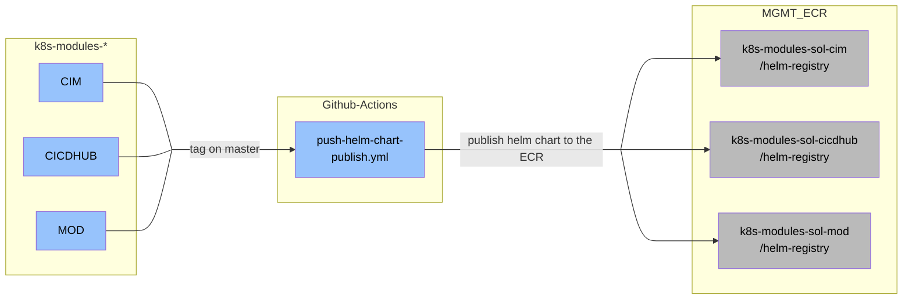

This article explains how to publish custom helm charts via AWS ECR. These can be used as OCI charts. One use case is declaring a chart as a helm dependency.

## How to use Helm Dependencies

This process is not intended to replace the helm_render approach. The use case here is to enable other application teams to reuse the published helm chart to reduce work on writing the same helm charts over and over again.

Helm supports dependencies which reference other Helm Charts in a Container Registry, here the ECR. To reference a helm chart as a dependency please refer to the Helm Documentation [Helm Dependencies](https://helm.sh/docs/helm/helm_dependency/) and to set and overwrite values of the helm chart dependency follow the documentation [Override Global Chart Values](https://helm.sh/docs/chart_template_guide/subcharts_and_globals/#global-chart-values).


It is also possible to use OCI Helm Charts directly as a source in ArgoCD. As an example you can follow the documentation [Use OCI Helm charts](https://github.vodafone.com/pages/VFDE-ISS/cet-eks/docs/concepts/systemapps/#use-oci-helm-charts).


## Requirements

- The GitHub workflows `pr-helm-chart-build.yml` and `push-helm-chart-publish.yml` must be synced to your repository

## Concept
By pushing a commit tag on the master branch in a `k8s-modules` repository, the GitHub workflow `push-helm-chart-publish.yml` will be triggered and publishes the custom helm chart in the corresponding ECR of the project.

### Key Features
- Reuse of existing ECR infrastructure
- Every Team has its own `k8s-modules` repo to publish and share custom helm charts
- Autorelease after tagging on the master

## Naming Convention

With pushing a tag on the master branch, the respective helm chart is published in AWS ECR. The tag prefix must be equal to the directory name and the intended version, e.g.: `my_chart/v0.1.1`. The version in the tag is then used as the chart version, means the version in your `Chart.yaml` will be ignored and doesn't have to be maintained, instead use the tag for versioning. The `name` in your `Chart.yaml` will be your chart name in the end and also decides the name in the Container Registry.


## Configuration and Structure of the Helm Chart

All charts located in the `charts/<COMPONENT>` folder can be published by the GitHub action if configured. To configure which charts you want to publish in the component folder, the configuration file `helm_package_config.yaml` is required at the component folder's root level (see the cropped file tree). If the configuration file is missing, the GitHub workflow is cancelled and nothing will be published.

A cropped file tree of the `postsync-job` folder:

```
 |-README.md
 |-helm_package_config.yaml
 |-chart
 | |-templates
 | | |-postsync-job
 | | | |-external-secrets.yaml
 | | | |-postsync-job.yaml
 | | | |-secrets-store.yaml
 | | | |-serviceaccount-secrets.yaml
 | |-values.yaml
 | |-Chart.yaml
 |-monitoring-chart
 | |-template
 | | |-serviceaccount.yaml
 | |-values.yaml
 | |-Chart.yaml
```


The `helm_package_config.yaml` configures which charts to package and publish:
```yaml
ociPushes:
  - chart
  - monitoring-chart
```
Each list entry in `ociPushes[]` points to a directory which contains a helm chart. The list defines which charts are uploaded to the ECR. As an example, the `chart` list entry indicates to push `charts/<COMPONENT>/chart` to the ECR. All paths are relative to the component folder and the paths need to lead to the directory containing the `Chart.yaml`.


In the end the config file should only contain the chart paths which should be packaged and published.


## Add your ECR Repository

To publish helm charts as OCI artifacts, ECR repositories are required. To create these, reuse the existing `ecr-k8s-modules-<PROJECT>` GitHub repositories used to for container image registries.

The registries for helm charts follow a specific naming: `helm-registry/<COMPONENT>/<CHART_NAME>`

- `helm-registry` - A fixed prefix to group registries. You cannot change this.
- `<COMPONENT>` - The component the helm chart belongs to. Equal to the tag prefix (`<COMPONENT>/v1.2.3`) and the directory name (`charts/<COMPONENT>`) in the `k8s-modules-sol-<PROJECT>` repository.
- `<CHART_NAME>` - The name of the chart, defined in the respective `Chart.yaml`. This is independent of the chart's directory name. You must not have two charts with the same name in a `COMPONENT`.

In the example from [Configuration and Structure of the Helm Chart](#configuration-and-structure-of-the-helm-chart), the `COMPONENT` is `postsync-job` and the chart names from the `Chart.yaml`s are `postsync-job` and `monitoring-chart`. The charts will be published as `helm-registry/postsync-job/postsync-job` and `helm-registry/postsync-job/monitoring-chart`. Note that the name of the first chart matches the directory name it is located in. This only works because the chart and directory names are identical.
