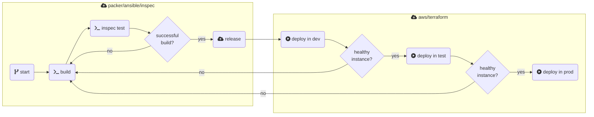


GitHub actions works by chaining roles, make sure your build doesn't last more than an hour, since when you chain roles the maximum length of time your credentials will last is an hour.

An easy solution can be using a bigger instance type for the build.


## Concept

### Key Features

#### Self containing packer repository

* [Taskfile](https://taskfile.dev/) to work with the packer repository
* Usage of the latest [packer-toolkit] docker image, including the following tools:
  * [Packer](https://developer.hashicorp.com/packer)
  * [Ansible](https://docs.ansible.com/)
  * [InSpec](https://docs.chef.io/inspec/)
* [GitHub Action](https://github.vodafone.com/VFDE-SOL/template-packer-ami/blob/master/.github/workflows/push-packer-build-ami.yml) for daily build, test builds and ami deployments


<!-- source: https://de.confluence.agile.vodafone.com/display/SOLS/Tesla+CET+-+Docs -->

Since [VFDE-SOL/template-packer-ami:v1.0.0](https://github.vodafone.com/VFDE-SOL/template-packer-ami) we use our [packer-toolkit] docker image to build and deploy aws ami's to ensure a version pinning of the tools for all parties.

The ami's will be created and stored in our `mgmt-sol-vfde` account and all solstice accounts have the possibility to access these images.

## Getting Started

### Workflow

For building Amazon EC2 AMIs Solstice provides a seperate type of repositories - the packer-ami repositories. Those repositories are pre-configured with Packer, Ansible and InSpec to provide you with the necessary tools to build an AMI.

The foundation to build an AMI is Packer. When you get a fresh packer-ami repository there will be some Packer files located in the root of the repository that can be modified and extended to build your own AMI. Within those Packer hcl files you can use provisioners. The provisioners provided by default are Shell, Ansible and InSpec. As the folder structure of the repository indicates InSpec related files should be placed in /inspec while files related to Ansible or Shell provisioners should be placed under /provisioners/ansible and /provisioners/shell.


To avoid the configuration of all those tools regarding access and authorization to Solstices AWS infrastructure, Tesla provides you with a Docker image (the packer-toolkit image) that has all those configurations allready done and allows you to test the build process for your image within a container. For this repository itself gets mounted in the container, this allows you to modify the code in your local IDE (mostly Visual Studio Code in the WorkSpace) and to run the code via perconfigured Packer in the container.

The final build of an AMI can´t be done localy (within the container). This is done via a GitHub action that gets triggered as soon as you contributed your code to the master branch and created a new GitHub release. After this the AMI is availlable in Solstices management account and can be pulled by all other Solstice accounts.


### Taskfile

We recommend to install [Task](https://taskfile.dev/installation/) for a simple interaction with the packer repositories:

```
# task --list

task: Available tasks for this project:
* ansible-collection-init:         Initialize new ansible collection with the base structure
* ansible-collection-install:      Install new ansible collection via ansible-galaxy
* ansible-collection-update:       Update ansible collection via ansible-galaxy
* ansible-validate-playbooks:      Validate ansible playbooks
* create-legacy-packer-deps:       Create legacy ssm parameter files locally
* docker-login:                    Login to docker registry on aws ecr
* docker-run:                      Execute packer-toolkit container with interactive bash
* packer-build:                    Execute packer-toolkit container and start packer build
```

Please create a `Taskfile.local.yml` under your local checkout and set your personal NGUM role:

```yml
version: '3'

env:
  # Set your personal VFCF-CET role here, if you not set it globally:
  SOL_CET_USER_ROLE: "AddYourRoleHere"
```
The Ansible commands make working with Ansible easier for you while the Docker related commands deal with aforementioned Docker image. As Tesla does not provide this image public you need to login to Solstice ECR before pulling it. For this you can use the docker-login task. After successfully logging in you can either execute the docker-run command to start an container from the image and get an interactive shell in it or execute the packer-build task to execute a packer build run in the container from the image and check if the build process can be executed successfully. As alreday mentioned for the docker commands the repository itself gets mounted in the container, this allows you to modify the code in your local IDE (mostly Visual Studio Code in the WorkSpace) and to run the code via perconfigured Packer in the container.


### GitHub Action for packer builds

There will be a daily build of an image to constantly check the compatibility to the parent image.
In case of a failure, a GitHub issue will be automatically created in your repository, so that you are notified.

If you want to deploy a new ami, you just need to create a new **GitHub release**.

### Demo packer setup

The [VFDE-SOL/template-packer-ami](https://github.vodafone.com/VFDE-SOL/template-packer-ami) repo contain a demo setup which is also used for testing.

Please cleanup or delete the demo setup after you created your packer setup in the final repo.

## Usage of solstice ami's

After successfully building and deploying an ami for the first time, you need to enable your aws account to access the ami's.
For this your have to deploy the [terraform-component-ami-builder/consumer](https://github.vodafone.com/VFDE-SOL/terraform-component-ami-builder#terraform-component-ami-builderconsumer) component in your environments.

Here you can find an example implementation: [VFDE-SOL/terraform-project-sol-vfcf](https://github.vodafone.com/VFDE-SOL/terraform-project-sol-vfcf/tree/master/env/dev/eu-central-1/application/ami-consumer)


## Staging

If you following the [golden image](https://mycloudit.com/blog/everything-you-need-to-know-about-golden-images) approach, you are also able to stage your ami's through your environments. An example workflow could look like this:



## Base amis in solstice

| AMI FILTER                  | OS             | DESCRIPTION                                     | REPOSITORY |
| ---                         | ---            | ---                                             | ---        |
| CIS-AMZN2-PCS-2023*         | Amazon Linux 2 | solstice base image based on pcs hardened image | [VFDE-SOL/packer-ami-amzn2-pcs-base](https://github.vodafone.com/VFDE-SOL/packer-ami-amzn2-pcs-base)
| vf-pcs-amazon-linux-2-2023* | Amazon Linux 2 | pcs hardened image based on aws amzn2 image | [VFGroup-GDC-PCS/pcs-cloud-0500-image-hardening-amazon-linux-2](https://github.vodafone.com/VFGroup-GDC-PCS/pcs-cloud-0500-image-hardening-amazon-linux-2)
| amzn2-ami-hvm-2.0.2023*     | Amazon Linux 2 | Amazon Linux 2 maintained Linux image provided by Amazon Web Services | [Amazon Linux 2 AMI (HVM), SSD Volume Type (64-bit x86)](https://aws.amazon.com/marketplace/pp/prodview-zc4x2k7vt6rpu)
