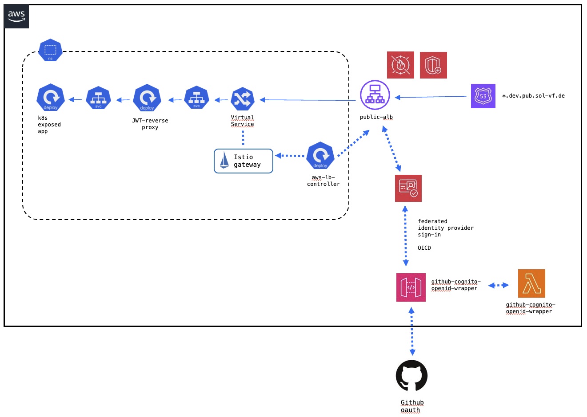
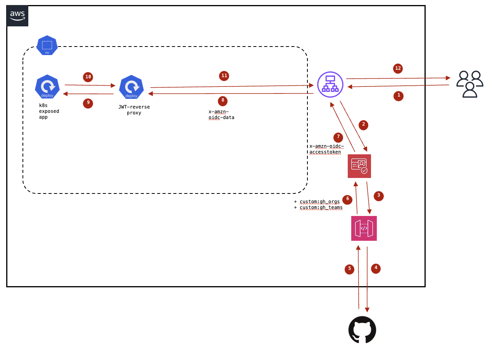
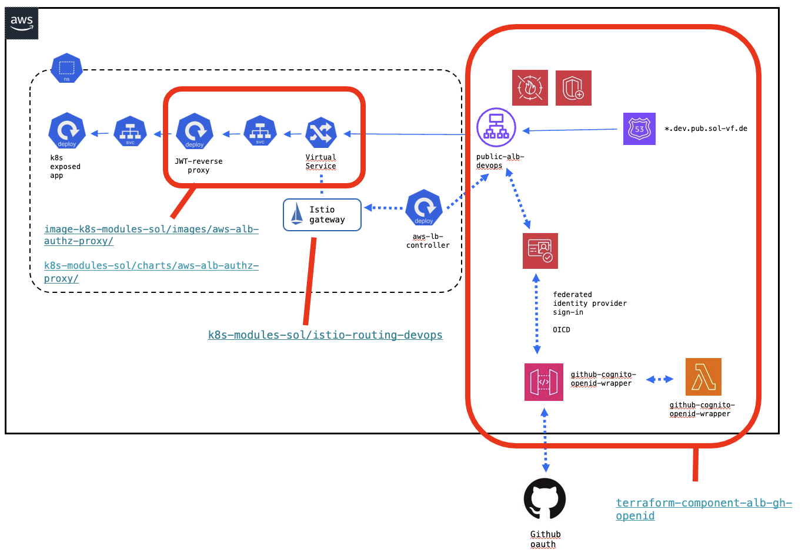
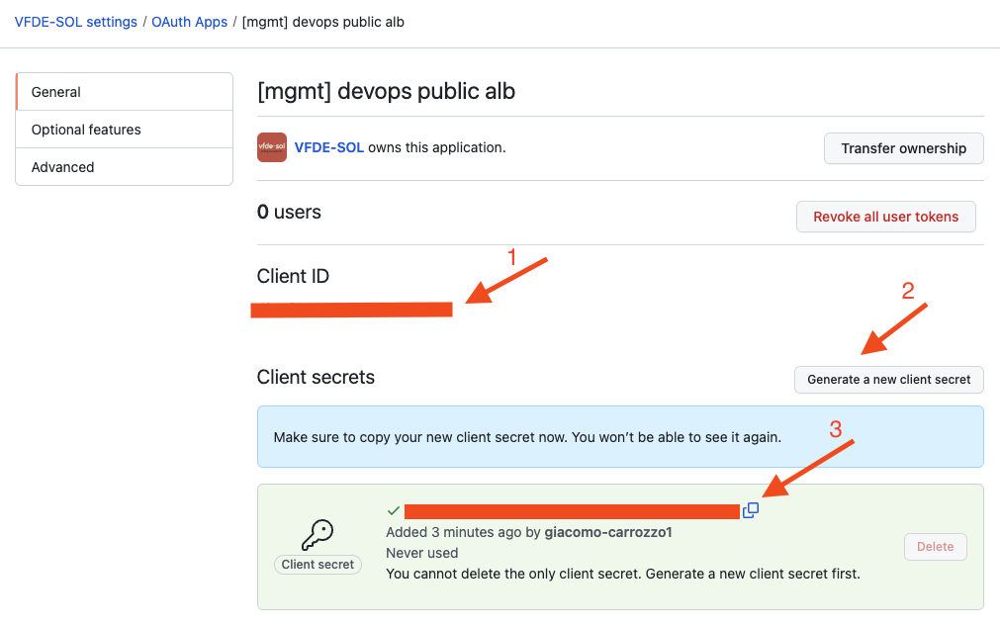

# Public Load Balancer Deployment with Github authentication


The versions and configurations are subject to change. Please see this as orientation on where to look, and ensure you always have the correct versions and configuration matching your environment.


## Concept

Here we describe a secure infrastructure to enable applications running in a Kubernetes cluster to be available via public internet with Github authentication.

### Executive Summary

The project leverages AWS services, including a Public Load Balancer with Web Application Firewall (WAF) and Shield, Amazon Cognito for authentication, API Gateway and Lambda functions as a shim to wrap Github oauth and Istio for communication between the Application Load Balancer (ALB) and the Kubernetes components.

The authorization process is managed by a k8s reverse proxy that will check it JWT of the user the required params to access the requested endpoint.

### Feature Overview

- Securely enable applications running in a Kubernetes cluster to be reachable over the internet
- AWS WAF and Shield to protect against common web threats
- AuthN: ALB enforces user authentication
- Custom OpenID shim to wrap GitHub's OAuth so it can be used on the ALB
- Establish secure communication between the ALB and the Kubernetes cluster using Istio and the AWS Load Balancer Controller
- AuthZ: check if the user is authorized to access the requested k8s application (oauth2proxy option)


### Architecture Summary

[](./public-alb-architectural-diagram.png)


### Request Flow

[](./public-alb-flow-schema.png)


## Installation

[](./public-alb-component-diagram.png)

### Creating the OAuth App

Follow these steps to create a new OAuth App in GitHub (one per account):

- **Step 1: Access the OAuth App Creation Page**

  Visit the [GitHub OAuth Apps page](https://github.vodafone.com/organizations/VFDE-SOL/settings/applications) within your organization's settings. (use your user's settings if you do not have access to the org)

- **Step 2: Create a New OAuth App**

  Click on the "New OAuth App" button or a similar option to start the creation process.

- **Step 3: Fill in the Required Information**

  Fill in the required information for your OAuth App:
    - **Application name:** `[<ENV_NAME>] devops public alb` (example: `[int-done] devops public alb`)
    - **Homepage URL:** `https://auth.<ENV_NAME>.pub.sol-vf.de` (example: `https://auth.int.done.pub.sol-vf.de`)
    - **Application description** `Authenticate users using an Application Load Balancer`
    - **Authorization callback URL:** `https://auth.<ENV_NAME>.pub.sol-vf.de/oauth2/idpresponse`  (example: `https://auth.int.done.pub.sol-vf.de/oauth2/idpresponse`)

- **Step 4: Obtain Client ID and Client Secret**

  Within the new app page, copy the client ID, then click on the "Generate a new client secret" button. GitHub will generate a **Client Secret**. Save those two for later.

- **Step 5: Transfer Ownership of Oauth App to VFDE-SOL Organisation**

  Optional: If you created the OAuth App in your GitHub User's settings, please remember to transfer the ownership to the ORG.

When in doubt use the github documentation: [Creating an OAuth App](https://docs.github.com/en/enterprise-server@3.8/apps/oauth-apps/building-oauth-apps/creating-an-oauth-app).

[](./public-alb-oauth-client.png)

### Terraform AWS Resources


The following steps can't be done in one PR, please split them up.


Follow these steps to create the needed AWS Resources:

- **Step 1 Enable Pub Domain**

	This solution requires an additional public hosted zone.

	Make sure you have set `enabled_pub_domain  = true` in your dns module (available with >= network/dns/v0.3.0).

	This will create a public hosted zone `<ENV_NAME>.pub.sol-vf.de`.

	The applications will be available as `https://<APP_NAME>.<ENV_NAME>.pub.sol-vf.de/`.  (example: `https://
portal.int.done.pub.sol-vf.de/`)

	[Example Terraform Project Configuration](https://github.vodafone.com/VFDE-SOL/terraform-project-sol-cone/blob/master/env/dev-cone/eu-central-1/network/dns/terragrunt.hcl)

- **Step 2 Add Auth Certificate in us-east-1 for Authorization callback URL**

	We need a certificate for our auth custom domain, cognito requires this to be in region `us-east-1`.

	[Example Terraform Project Configuration](https://github.vodafone.com/VFDE-SOL/terraform-project-sol-cone/blob/master/env/dev-cone/us-east-1/network/public_gh_auth_cert/terragrunt.hcl)

- **Step 3 Add Module public\_gh\_auth\_alb**

	For convenience we created a module [terraform-modules-sol/public_gh_auth_alb](https://github.vodafone.com/VFDE-SOL/terraform-modules-sol/tree/master/modules/network/public_gh_auth_alb).

	It combines the needed generalised components for this use case:

	- [terraform-component-cognito-github-openid-wrapper](https://github.vodafone.com/VFDE-SOL/terraform-component-cognito-github-openid-wrapper)
	- [terraform-component-lb](https://github.vodafone.com/VFDE-SOL/terraform-component-lb)
	- [terraform-component-waf-webaclv2](https://github.vodafone.com/VFDE-SOL/terraform-component-waf-webaclv2)

	[Example Terraform Project Configuration](https://github.vodafone.com/VFDE-SOL/terraform-project-sol-cone/blob/master/env/dev-cone/eu-central-1/network/public_alb_github_auth/terragrunt.hcl)

	Make sure all the exposed application in the account under `application_subdomains`, those will be be added as allowed callback URLs on the ALB Cognito Client.


- **Step 4: Put Client ID and Secret in the secrets manager secret for the account**

  Click-ops via AWS web-console:

  Choose the secret named `sol-<ENV_NAME>-public-alb-github-auth-github-app`.

  Click the *Retrieve secret value* button in the *Secret value* section, followed by clicking on *Edit*. Update the values for `github_client_id` and `github_client_secret` with the previously copied information, and finally, save the changes.


### Kubernetes Configuration

#### istio-routing-devops

This module serves as an implementation of the Istio Ingress Gateway, taking charge of overseeing external access to services within the Kubernetes (k8s) cluster. Its primary function is to establish a centralized hub for the efficient management and control of traffic routing, security enforcement, and observation across your microservices architecture. To seamlessly register the cluster's entry point as targets for the application load balancer, it is crucial to ensure the proper integration of the [aws-lb-controller](https://github.vodafone.com/VFDE-SOL/k8s-modules-sol/tree/master/charts/aws-lb-controller).

In order to enable `istio-routing-devops` use `cet-eks-sol-additions` module:

Example Configuration

```yaml
apiVersion: argoproj.io/v1alpha1
kind: Application
metadata:
  name: "cet-eks-sol-additions"
  finalizers:
  - resources-finalizer.argocd.argoproj.io
spec:
  destination:
    namespace:  {{ .Release.Namespace }} 
    server: "https://kubernetes.default.svc"
  project: "local"
  source:
    path: charts/cet-eks-sol-additions/chart
    repoURL: https://github.vodafone.com/VFDE-SOL/k8s-modules-sol
    targetRevision: cet-eks-sol-additions/v0.26.0
    helm:
      values: |
        apps:
          istio-routing-devops:
            enabled: true
```

Make sure that in the `values` of the cluster (`k8s-apps-SHORT_NAME-sol-vfde/apps/values.yml`) there are the **Target Group ARN** and **Security Group ID** values: `eks.publicAlb.targetGroupArn` and `eks.publicAlb.sourceSecGroup`.
If they are not there, add them inside the `values`.

#### aws-alb-authz-proxy

The [aws-alb-authz-proxy](https://github.vodafone.com/VFDE-SOL/k8s-modules-sol/tree/master/charts/aws-alb-authz-proxy) is designed to serve as an auxiliary service for the purpose of authorizing requests initiated by users. It functions as a reverse proxy, responsible for the decoding and validation of JWT (JWS) tokens. Additionally, it verifies whether the user is authorized to make a particular endpoint call by examining specific parameters defined within the configuration file.

It should be placed in front of every application that is exposed by a Public Load Balancer and does not come with its own GitHub Oauth App configuration.

The required configuration for this setup is as follows:

```yml
apiVersion: argoproj.io/v1alpha1
kind: Application
metadata:
  name: aws-alb-authz-proxy-<COMPONENT_NAME>
  labels:
    project: "{{ .Values.project }}"
    account: "{{ .Values.shortAlias }}"
    clusterName: "{{ .Values.eks.clusterName }}"
  finalizers:
    - resources-finalizer.argocd.argoproj.io
spec:
  destination:
    namespace: prometheus
    server: "{{ .Values.eks.server }}"
  project: target
  source:
    path: charts/aws-alb-authz-proxy/chart
    repoURL: "https://github.vodafone.com/VFDE-SOL/k8s-modules-sol"
    targetRevision: aws-alb-authz-proxy/v0.8.0
    helm:
      values: |
        jwtproxy:
          componentName: "<COMPONENT_NAME>"
          host: "<COMPONENT_NAME>.{{ .Values.shortAlias | replace "-" "." }}.pub.sol-vf.de"
          gateway: "istio-routing-devops/gateway-devops"
          nodeSelector: null

          replicas: 1

          upstream: "<COMPONENT_EXPOSED_SERVICE>"
          claims_verifiers: # modify according to your team name
          - claim: custom:gh_teams
            conditions:
              contains: VFDE-SOL/team-tesla

        forecastle:
          enabled: true
          name: "<COMPONENT_NAME>"
          icon: "<ICON_URL>"
          group: "<COMPONENT_GROUP>"
          url: "https://<COMPONENT_NAME>.{{ .Values.shortAlias | replace "-" "." }}.pub.sol-vf.de"

  syncPolicy:
    automated:
      prune: true
      selfHeal: true
```

## FAQ

### Why am I encountering the following error when accessing my application? "An error was encountered with the requested page."

Please verify if your application is whitelisted under `application_subdomains` in `env/<ENV_NAME>/eu-central-1/application/public_alb_devops/terragrunt.hcl`

### How can I authenticate the user within my application?

Depending on your app configuration, there are several ways to achieve this:
1. You can enable JWT token rewriting using the `rewrite_auth_jwt` option of `aws-alb-authz-proxy`. This feature allows the reverse proxy to rewrite the JSON Web Token (JWT) to the `Authorization: Bearer <token>` HTTP header before forwarding the request to the backend service specified in the 'upstream' field.

2. Alternatively, you can retrieve user data from the HTTP Header by enabling the `pass_user_headers` option. For more information, refer to the [aws-alb-authz-proxy documentation](https://github.vodafone.com/VFDE-SOL/k8s-modules-sol/tree/master/charts/aws-alb-authz-proxy).

### Why am I getting a `UNAUTHORIZED 401` error when trying to access my application?

You may have misconfigured the `aws-alb-authz-proxy` component. Please check the configuration under `claims_verifiers` in your component and ensure that your user is part of the Github team or organization declared in the configuration.

### My application is not running on Kubernetes but on an EC2. Can I use this component to expose my application?

Yes at your own risk and responsibility. The _Public Load Balancer Deployment_ component will provide only __authentication and no authorization__. It will authenticate users as part of Vodafone's GitHub but it will not enforce/check membership to any teams.

It is your responsiblity to configurate your application to check the team membership to ensure authorization.

As you will probably have to customize some configurations we recommend that you create your own module in your projects module repo based upon [terraform-modules-sol/public_gh_auth_alb](https://github.vodafone.com/VFDE-SOL/terraform-modules-sol/tree/master/modules/network/public_gh_auth_alb) to enable you to do changes to your usecase.
