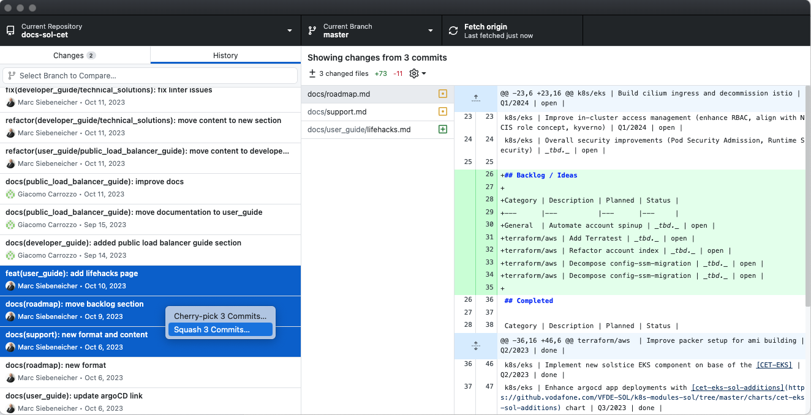

## Search for account infos via `caws`

You can easily display and search for solstice account infos via [caws]:

```sh
# dispaly all solstice accounts
caws accountinfo --project 'sol'

# search for all accounts of a subproject
caws accountinfo --project 'sol'| grep 'done'
```

## Creating `AWS Extend Switch Roles` plugin configuration via `caws`:

You can create an `AWS Extend Switch Roles` plugin configuration via [caws] and copy/paste it to your browser:

```sh
# display configuration
caws accountinfo --project 'sol'  -o ext-switch-roles -r YOUR-AWS-ROLE

# cp configuration directly to clipboard on mac
caws accountinfo --project 'sol'  -o ext-switch-roles -r YOUR-AWS-ROLE | pbcopy
```

## Install only specific subproject resources to your local environment

You can use the provided installer by the [sol-cet-devtools] also to clone only resources for a specific subproject.

```sh
# direct script usage
gh_install_sol_resources --filter ebpa

# or for snab installation
vfsol gh install-cet-resources --filter ebpa
```

## Do squash commits via GitHub Desktop

If you are struggling to do squash commits on your local branch via git-cli you can also use [GitHub Desktop](https://desktop.github.com/):

[](./lifehacks_git_squash.png)

See also the [official docs](https://docs.github.com/en/desktop/managing-commits/squashing-commits-in-github-desktop) for this and don't try to squash on the `master` or `main` branch!

---

[caws]: https://github.vodafone.com/VFTech-SDaaS/Tool-caws
[sol-cet-devtools]: https://github.vodafone.com/VFDE-SOL/sol-cet-devtools
