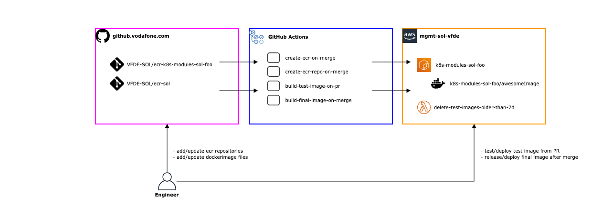
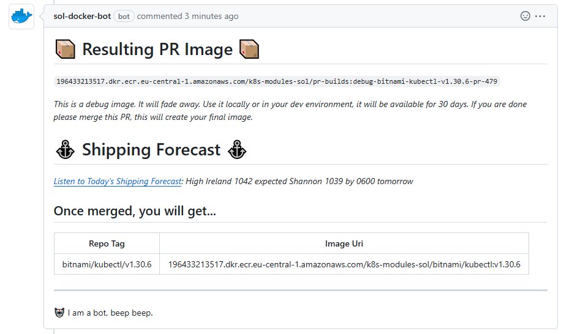


This solution works with two different kinds of repositories: There are repositories in git and GitHub, and there are repositories in AWS ECR. Make sure to not mix them up.


## Concept

This action supports builds from public docker registries. If your build requires the login to a private registry, the action needs to be customized.

[](./docker-image-workflow.png)
<!-- source: https://de.confluence.agile.vodafone.com/display/SOLS/Tesla+CET+-+Docs -->

### Key Features

- Own ecr setup for subprojects
- Enforce immutable repository (non-negotiable [security requirement](https://aquasecurity.github.io/tfsec/v1.8.0/checks/aws/ecr/enforce-immutable-repository/))
- Temporary and testable image builds on pull request level
- Auto release after merging a pull request

## Toolchain Setup: GitHub Repositories


This is a one-time activity to onboard subprojects. Check if the two Github repositories explained below already exist for your use case, and skip these steps if so.


Create two repositories from <a href="https://github.vodafone.com/VFDE-SOL/meta-org-repos" target=_blank><i class="fa-brands fa-github"></i> VFDE-SOL/meta-org-repos</a>. Follow the instructions in the README and do copy from similar, already existing repositories. You need to create:

- `ecr-k8s-modules-sol-<PROJECT_SUFFIX>` (e.g. `ecr-k8s-modules-sol-cicdhub`), based on the template `VFDE-SOL/template-ecr`
- `image-k8s-modules-sol-<PROJECT_SUFFIX>` (e.g. `image-k8s-modules-sol-cicdhub`), based on the template `VFDE-SOL/template-image`

Raise a PR and get it merged, so the repositories are created via gitops. Then, initialize the repositories by checking all `TODO` & `REPLACE_ME` comments and adjusting the README contents. Additionally, move the content in the `terraform` directory, as one directory also contains a `REPLACE_ME` part.

## Create An ECR Repository

For this step, use the `ecr-` GitHub repository, explained here [Toolchain Setup: GitHub Repositories](#toolchain-setup-github-repositories).

Firstly, an image needs a location to be stored, which is a ECR repository. To create it, place an empty file (named after the ECR repository that you want to create) in the `repos` directory. GitHub actions will create (or delete) ECR repositories upon merge.

The empty file location decides about the ECR path: The file `repos/some/nested/path` maps to the ECR repository `<GITHUB_REPOSITORY_NAME>/some/nested/path` in Tesla's mgmt account. It strips the `repos` name, and adds the GitHub repository name as prefix.

## Build And Push An Image

For this step, use the `image-` GitHub repository, explained here [Toolchain Setup: GitHub Repositories](#toolchain-setup-github-repositories).

There are multiple files relevant to define an image build. There are two solutions that can be used. Both of them rely on putting the respective files in the right location.

Given that an ECR repository was created with the file `repos/some/nested/path` in the GitHub repository `ecr-k8s-modules-sol-myproject`, the location for the image build definition is the directory `images/some/nested/path/` in the GitHub repository `image-k8s-modules-sol-myproject`:

- The project suffix of the `ecr-` and `image-` GitHub repository must match
- The path of the directory in `images` must match the path of the empty file in `repos`

Pull requests create ephemeral and mutable images per change. The image details are communicated as PR comments, e.g.



PR images are mutable, so changes to the PR branch are propagated to consuming solutions (e.g. EKS) without adjustment. Note that there is no automatic react to changes of an image.

Once the PR is merged to `master`, it will push the final image with an immutable tag.

{}
Immutable means that every other change that tries to create an image with the same tag/version will fail. Immutable images must not and cannot be overridden!
{}

#### Solution 1: Image mirroring

This is the case when there is a public container image that is to be copied to ECR, but not modified. Create a `image_transfer.yml` file and put in a single `from` information like this:

```yaml
from: quay.io/argoproj/argocd:v2.13.0
```

This will read the version from the config and automatically copy the image from the upstream to the private ECR with the same version tag.

#### Solution 2: Custom Dockerfile

When images are to be customized, a classic [`Dockerfile`](https://docs.docker.com/reference/dockerfile/) can be used. The resulting image is then pushed with the tag located in the `image_tags` file. While these are the only two required files, arbitrary files can be committed and referenced in the Dockerfile, e.g. with a `COPY` command.

**Example**

The following config will generate a new container image with version `v1.2.3`.

`Dockerfile`:
```Dockerfile
FROM scratch

COPY ./assets /app
ENTRYPOINT ["/app/binary"]
```

`image_tags`:
```
v1.2.3
```

## CPU Architectures

Building images for multiple CPU architectures is supported. By default, images are built for `x86_64` and `arm64`/`aarch64`, both for linux only.

To limit the image builds to only `x86_64`, either add an empty `image_no_multi_arch` file or in `image_build.yml`, set the `multi_arch` value to `false`.

## Vodafone Github access during build process

In case it is required to have Vodafone Github access during the build, the [GITHUB_TOKEN](https://docs.github.com/en/actions/security-guides/automatic-token-authentication#about-the-github_token-secret) secret from the workflow can be accessed as a [Docker build secret](https://docs.docker.com/engine/reference/commandline/buildx_build/#secret) with the id `github_token`. The provided token has limited privileges, but can be used to access *public* VF repos.

Here is an example how to setup the Github CLI from the provided Github Token during the docker build:

```Dockerfile
# code snippet for one secrets
RUN --mount=type=bind,target=/run/secrets,rw \
    --mount=type=secret,id=github_token \
    cat /run/secrets/github_token | gh auth login --hostname github.vodafone.com --with-token -p https
```

Follow the [Docker docs](https://docs.docker.com/engine/reference/commandline/buildx_build/#secret) for more information on how to use build secrets.


## Private Registry Support

The Workflow supports a private registry as source, by repository secrets and variables.

```yml
      - name: Login to custom registry
        uses: VFDE-SOL/mirror-action-docker-login-action@v3
        if: steps.check-custom-registry.outputs.present == 'true'
        with:
          registry: ${{ vars.CUSTOM_REGISTRY }}
          username: ${{ secrets.CUSTOM_REGISTRY_USERNAME }}
          password: ${{ secrets.CUSTOM_REGISTRY_PASSWORD }}
```

## Internal Vodafone Certificate Support

Supports certificates signed by internal `VCA`.
