Privileged Access Management ([PAM](https://de.confluence.agile.vodafone.com/display/SOLS/PAM+as+Code+in+GitHub)) is the new concept for accessing an AWS account in Soltice. It also controls the ability of users to assume another IAM Roles with elevated permissions.

It is compatible with the basic tools used by the DevOps teams (e.g. _awscli, terraform, kubeconfig_). The next paragraph describes the steps test and start using PAM tool. For setup, please follow the [Getting Started](../../getting_started/).


If your project/AWS account has not yet been on-boarded to the PAM tool, please wait for further indication from the NCIS team.



# Requirements

If you are using Workspaces or followed the instructions of the "Getting Started", you should have already these tools:
- [bash](https://www.gnu.org/software/bash/) (>= v5)
- [git-cli](https://git-scm.com/downloads)
- [GitHub CLI](https://cli.github.com/)
- [saml2aws](https://github.com/Versent/saml2aws) (>= v2.36.13)
- [caws](https://github.vodafone.com/VFTech-SDaaS/Tool-caws) ( >= v0.3.0)

Install all Solstice resource following [sol-cet-devtools](https://github.vodafone.com/VFDE-SOL/sol-cet-devtools) and running [gh_install_sol_resources](https://github.vodafone.com/VFDE-SOL/sol-cet-devtools#gh_install_sol_resources). It will download locally all Solstice repositories including the minimum needed:
- [caws-accounts-sol](https://github.vodafone.com/VFDE-SOL/caws-accounts-sol)
- (being deprecated) [caws-mappings-sol](https://github.vodafone.com/VFDE-SOL/caws-mappings-sol)

Run the initial setup [installer/sh](https://github.vodafone.com/VFDE-SOL/sol-cet-devtools/blob/master/installer/sh) from [sol-cet-devtools](https://github.vodafone.com/VFDE-SOL/sol-cet-devtools). The script will automatically create CAWS mappings file.


# Test the configs

## Command line

Verify that the shell alias work properly.
- with_sol_\<short-alias\> - uses the legacy IAM Role (to be dismissed)
- with_sol_\<short-alias\>\_infdevops - uses the IAM Role **INF-DEVOPS** part of the PAM solution
- with_sol_\<short-alias\>\_admin - uses the IAM Role **AccountAdmin** part of the PAM solution
- with_sol_\<short-alias\>\_kubeadmin - (optional) uses the IAM Role **KubeAdmin** part of the PAM solution
- with_sol_\<short-alias\>\_builder - uses cross-account IAM Role **Builder** located in _mgmt-sol-vfde_, useful for building AMI images
\
From the previous example, the project _AFMS_ in the _development_ stage, where the legacy IAM role was _VodafoneInfra_ the expected aliases created by CAWS are:
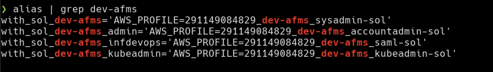

Try running a simple AWS Command returning your own identity. Prefix this command with the appropriate alias for your case.
```sh
aws sts get-caller-identity
```

For example:
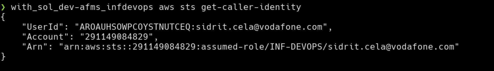



You must be already part to the appropriate [nGUM Group](https://ngum.vodafone.com/), in order to make use of the new IAM Roles of the PAM solution. The groups available for the PAM concept are listed [here](https://de.confluence.agile.vodafone.com/x/Nt7ZDw). If that is not the case, the CAWS prompt will reports an error when you try to use the new aliases (*with_sol_\<short-alias\>\_infdevops, with_sol_\<short-alias\>\_admin* or *with_sol_\<short-alias\>\_kubeadmin*)



The aliases *with_sol_\<short-alias\>\_admin* or *with_sol_\<short-alias\>\_kubeadmin* will allow you to assume the next role AccountAdmin or KubeAdmin. You need to have the appropriate grant to perform the escalation from INF-DEVOPS to one of the roles with elevated permissions. These grants are controlled via a GitHub repository *iam-sol-\<ProjectAcronym\>*. Open an Issue following the template to request it


### Troubleshooting

- Make sure you have the proper environment variable set:
```sh
env | grep SOL_CET
```
For example:
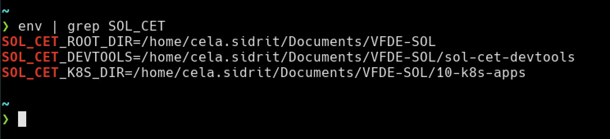


- Check if the environment variables needed by CAWS are present:
```sh
env | grep CAWS_
```
For example:
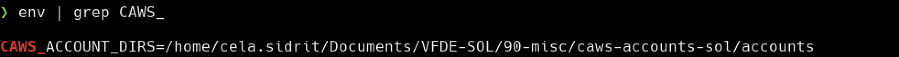


- Check if `caws setup`, refreshing aliases at every shell is in the local configs, depending on the shell.
If [installer/sh](https://github.vodafone.com/VFDE-SOL/sol-cet-devtools/blob/master/installer/sh) was used, the config is in `$HOME/.vf_fusionC`
```sh
grep "caws setup"  $HOME/.vf_fusionC
  [ -f "$HOME/.caws.hcl" ] && source <(caws setup --config "$HOME/.caws.hcl" 2>/dev/null)
```

Otherwise, if configs were setup manually, check your shell (depending on your environment e.g. _~/.localrc_ or  _~/.bashrc_ or _~/.zshrc_ etc). For example in a BASH shell:
```sh
grep "caws setup"  ~/.bashrc
source <(caws setup 2>/dev/null)
```

## Using Web GUI

Accessing the AWS web console using the new IAM roles of the PAM solution is quite straight forward and does not require configs. If you have been added to the appropriate [nGUM group](https://de.confluence.agile.vodafone.com/x/Nt7ZDw), go to the [Single Sign On login page](https://launcher.myapps.microsoft.com/api/signin/736c01bb-2416-4c60-a522-921da9cdcae0?tenantId=68283f3b-8487-4c86-adb3-a5228f18b893). You should already see the proper account in the list, which will allow you to assume the IAM Role *INF-DEVOPS*.
\
From the previous example, the project _AFMS_ in the _development_ stage:
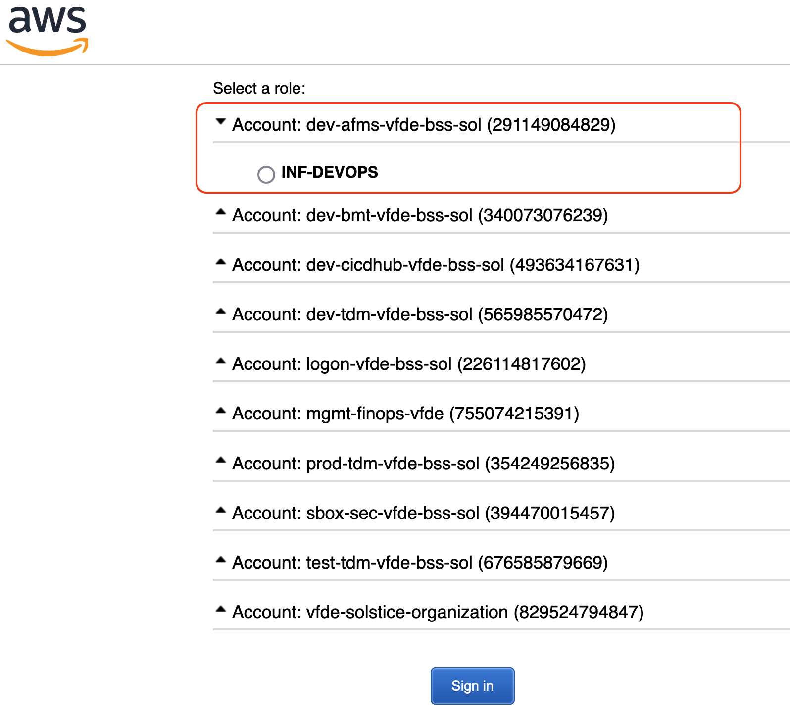

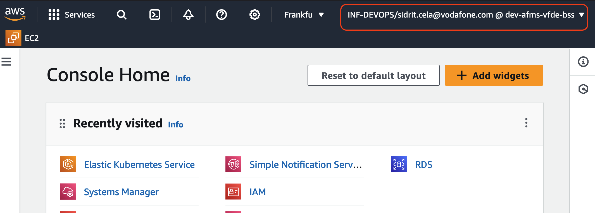

In order to escalate permissions, you need to assume one of the other roles. Provided that you have the grants controlled from the appropriate *iam-sol-\<ProjectAcronym\>* repository, use the AWS Web Console to assume one of the more powerful roles.
\
For example, assuming the AccountAdmin via Web GUI on the _dev-afms_ stage looks like:
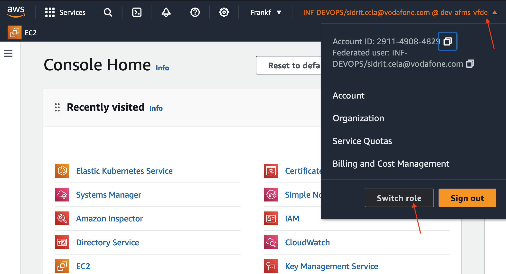

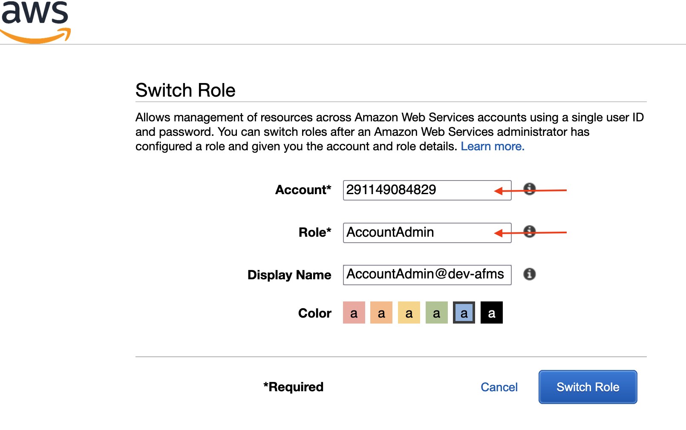


# (Re)Generating CAWS configs

If necessary the the CAWS configs can be (re)generated, without rerunning a full installation ([installer/sh](https://github.vodafone.com/VFDE-SOL/sol-cet-devtools/blob/master/installer/sh)). The `sol_gen_caws_mappings` expects a template file, usually located in `${SOL_CET_DEVTOOLS}/assets/caws/.caws.hcl.tpl`. Following examples, assume correct setup of [sol-cet-devtools](https://github.vodafone.com/VFDE-SOL/sol-cet-devtools) repos and environment variables.

## Example of Systemteam config

A user part of Systeteam (i.e. supporting/helping other FusionC projects and teams) has permissions to use one of the Infra role (applies also to other ***Infra roles like AmdocsInfra, VodafoneInfra, etc but they will soon be deprecated). CAWS configs can be generated:
```sh
sol_gen_caws_mappings -r Infra
```

Resulting `$HOME/.caws.hcl`
```hcl
# Role assumption from logon account
mapping "sol_logon" {
    selector {
      alias="logon-sol-vfde"
    }

    credential_process {
        role = "Infra"
        session_duration = 28800
        intermediate_profile_pattern = "%ACCOUNT_ID%_%SHORT_ALIAS%_infra-%PROJECT%"
        command = "saml2aws login --session-duration %SESSION_DURATION% --role arn:aws:iam::%ACCOUNT_ID%:role/%ROLE% --profile %INTERMEDIATE_PROFILE%"
    }

    profile_pattern = "%ACCOUNT_ID%_%PROJECT%_%SHORT_ALIAS%_deploy"
    region = "eu-central-1"
    shell_alias = "with_%PROJECT%_%SHORT_ALIAS%"
}

mapping "sol_account" {
    selector {
      project = "^sol$"
      short_alias = "^[^logon].*"
    }

    assume_role {
        role_arn = "arn:aws:iam::%ACCOUNT_ID%:role/Infra"
        source_profile = "226114817602_sol_logon_deploy"
    }

    profile_pattern = "%ACCOUNT_ID%_%SHORT_ALIAS%_infra-%PROJECT%"
    region = "eu-central-1"
    shell_alias = "with_%PROJECT%_%SHORT_ALIAS%"
}

mapping "sol_builder" {
  selector {
    project     = "^sol$"
    short_alias = "mgmt"
  }

  assume_role {
    role_arn       = "arn:aws:iam::196433213517:role/Builder"
    source_profile = "226114817602_sol_logon_deploy"
  }

  profile_pattern = "196433213517_%SHORT_ALIAS%_builder-%PROJECT%"
  region          = "eu-central-1"
  shell_alias     = "with_%PROJECT%_%SHORT_ALIAS%_builder"
}

# GENERATED_SUBPROJECT_MAPPINGS:START #
# GENERATED_SUBPROJECT_MAPPINGS:END #
```

## Example of DevOps config, using only PAM roles

A user part of a DevOps team has access to the PAM roles (INF-DEVOPS), specific to one or more FusionC projects. CAWS configs for project _acme1_ and _acme2_, which imply all stages part of those projects can be generated:
```sh
sol_gen_caws_mappings -p "acme1 acme2"
```

Resulting `$HOME/.caws.hcl`
```hcl
# GENERATED_SUBPROJECT_MAPPINGS:START #
## ---  project: acme1
mapping "acme1_inf-devops" {
  selector {
    project     = "^sol$"
    short_alias = ".*acme1$"
  }

  credential_process {
    role                         = "INF-DEVOPS"
    session_duration             = 28800
    intermediate_profile_pattern = "%ACCOUNT_ID%_%PROJECT%_%SHORT_ALIAS%_saml"
    command                      = "saml2aws login --session-duration %SESSION_DURATION% --role arn:aws:iam::%ACCOUNT_ID%:role/%ROLE% --profile %INTERMEDIATE_PROFILE%"
  }

  profile_pattern = "%ACCOUNT_ID%_%SHORT_ALIAS%_infdevops-%PROJECT%"
  region          = "eu-central-1"
  shell_alias     = "with_%PROJECT%_%SHORT_ALIAS%_infdevops"
}

mapping "acme1_account_admin" {
  selector {
    project     = "^sol$"
    short_alias = ".*acme1$"
  }

  assume_role {
    role_arn       = "arn:aws:iam::%ACCOUNT_ID%:role/AccountAdmin"
    source_profile = "%ACCOUNT_ID%_%SHORT_ALIAS%_infdevops-%PROJECT%"
  }

  profile_pattern = "%ACCOUNT_ID%_%SHORT_ALIAS%_accountadmin-%PROJECT%"
  region          = "eu-central-1"
  shell_alias     = "with_%PROJECT%_%SHORT_ALIAS%_admin"
}

mapping "acme1_kube_admin" {
  selector {
    project     = "^sol$"
    short_alias = ".*acme1$"
  }

  assume_role {
    role_arn       = "arn:aws:iam::%ACCOUNT_ID%:role/KubeAdmin"
    source_profile = "%ACCOUNT_ID%_%SHORT_ALIAS%_infdevops-%PROJECT%"
  }

  profile_pattern = "%ACCOUNT_ID%_%SHORT_ALIAS%_kubeadmin-%PROJECT%"
  region          = "eu-central-1"
  shell_alias     = "with_%PROJECT%_%SHORT_ALIAS%_kubeadmin"
}

# Cross-account toward mgmt
mapping "acme1_builder" {
  selector {
    project     = "^sol$"
    short_alias = ".*acme1$"
  }

  assume_role {
    role_arn       = "arn:aws:iam::196433213517:role/Builder"
    source_profile = "%ACCOUNT_ID%_%SHORT_ALIAS%_infdevops-%PROJECT%"
  }

  profile_pattern = "196433213517_%SHORT_ALIAS%_builder-%PROJECT%"
  region          = "eu-central-1"
  shell_alias     = "with_%PROJECT%_%SHORT_ALIAS%_builder"
}
## ---
## ---  project: acme2
mapping "acme2_inf-devops" {
  selector {
    project     = "^sol$"
    short_alias = ".*acme2$"
  }

  credential_process {
    role                         = "INF-DEVOPS"
    session_duration             = 28800
    intermediate_profile_pattern = "%ACCOUNT_ID%_%PROJECT%_%SHORT_ALIAS%_saml"
    command                      = "saml2aws login --session-duration %SESSION_DURATION% --role arn:aws:iam::%ACCOUNT_ID%:role/%ROLE% --profile %INTERMEDIATE_PROFILE%"
  }

  profile_pattern = "%ACCOUNT_ID%_%SHORT_ALIAS%_infdevops-%PROJECT%"
  region          = "eu-central-1"
  shell_alias     = "with_%PROJECT%_%SHORT_ALIAS%_infdevops"
}

mapping "acme2_account_admin" {
  selector {
    project     = "^sol$"
    short_alias = ".*acme2$"
  }

  assume_role {
    role_arn       = "arn:aws:iam::%ACCOUNT_ID%:role/AccountAdmin"
    source_profile = "%ACCOUNT_ID%_%SHORT_ALIAS%_infdevops-%PROJECT%"
  }

  profile_pattern = "%ACCOUNT_ID%_%SHORT_ALIAS%_accountadmin-%PROJECT%"
  region          = "eu-central-1"
  shell_alias     = "with_%PROJECT%_%SHORT_ALIAS%_admin"
}

mapping "acme2_kube_admin" {
  selector {
    project     = "^sol$"
    short_alias = ".*acme2$"
  }

  assume_role {
    role_arn       = "arn:aws:iam::%ACCOUNT_ID%:role/KubeAdmin"
    source_profile = "%ACCOUNT_ID%_%SHORT_ALIAS%_infdevops-%PROJECT%"
  }

  profile_pattern = "%ACCOUNT_ID%_%SHORT_ALIAS%_kubeadmin-%PROJECT%"
  region          = "eu-central-1"
  shell_alias     = "with_%PROJECT%_%SHORT_ALIAS%_kubeadmin"
}

# Cross-account toward mgmt
mapping "acme2_builder" {
  selector {
    project     = "^sol$"
    short_alias = ".*acme2$"
  }

  assume_role {
    role_arn       = "arn:aws:iam::196433213517:role/Builder"
    source_profile = "%ACCOUNT_ID%_%SHORT_ALIAS%_infdevops-%PROJECT%"
  }

  profile_pattern = "196433213517_%SHORT_ALIAS%_builder-%PROJECT%"
  region          = "eu-central-1"
  shell_alias     = "with_%PROJECT%_%SHORT_ALIAS%_builder"
}
## ---
# GENERATED_SUBPROJECT_MAPPINGS:END #
```

## Example of Systemteam config and PAM configs

A user part of Systeteam (i.e. supporting/helping other FusionC projects and teams) has a legacy _VodafoneInfra_ role and also access to PAM for project _acme1_.
```sh
sol_gen_caws_mappings -r VodafoneInfra -p acme1
```

Resulting `$HOME/.caws.hcl`
```hcl
# Role assumption from logon account
mapping "sol_logon" {
    selector {
      alias="logon-sol-vfde"
    }

    credential_process {
        role = "VodafoneInfra"
        session_duration = 28800
        intermediate_profile_pattern = "%ACCOUNT_ID%_%SHORT_ALIAS%_vodafoneinfra-%PROJECT%"
        command = "saml2aws login --session-duration %SESSION_DURATION% --role arn:aws:iam::%ACCOUNT_ID%:role/%ROLE% --profile %INTERMEDIATE_PROFILE%"
    }

    profile_pattern = "%ACCOUNT_ID%_%PROJECT%_%SHORT_ALIAS%_deploy"
    region = "eu-central-1"
    shell_alias = "with_%PROJECT%_%SHORT_ALIAS%"
}

mapping "sol_account" {
    selector {
      project = "^sol$"
      short_alias = "^[^logon].*"
    }

    assume_role {
        role_arn = "arn:aws:iam::%ACCOUNT_ID%:role/VodafoneInfra"
        source_profile = "226114817602_sol_logon_deploy"
    }

    profile_pattern = "%ACCOUNT_ID%_%SHORT_ALIAS%_vodafoneinfra-%PROJECT%"
    region = "eu-central-1"
    shell_alias = "with_%PROJECT%_%SHORT_ALIAS%"
}

mapping "sol_builder" {
  selector {
    project     = "^sol$"
    short_alias = "mgmt"
  }

  assume_role {
    role_arn       = "arn:aws:iam::196433213517:role/Builder"
    source_profile = "226114817602_sol_logon_deploy"
  }

  profile_pattern = "196433213517_%SHORT_ALIAS%_builder-%PROJECT%"
  region          = "eu-central-1"
  shell_alias     = "with_%PROJECT%_%SHORT_ALIAS%_builder"
}

# GENERATED_SUBPROJECT_MAPPINGS:START #
## ---  project: acme1
mapping "acme1_inf-devops" {
  selector {
    project     = "^sol$"
    short_alias = ".*acme1$"
  }

  credential_process {
    role                         = "INF-DEVOPS"
    session_duration             = 28800
    intermediate_profile_pattern = "%ACCOUNT_ID%_%PROJECT%_%SHORT_ALIAS%_saml"
    command                      = "saml2aws login --session-duration %SESSION_DURATION% --role arn:aws:iam::%ACCOUNT_ID%:role/%ROLE% --profile %INTERMEDIATE_PROFILE%"
  }

  profile_pattern = "%ACCOUNT_ID%_%SHORT_ALIAS%_infdevops-%PROJECT%"
  region          = "eu-central-1"
  shell_alias     = "with_%PROJECT%_%SHORT_ALIAS%_infdevops"
}

mapping "acme1_account_admin" {
  selector {
    project     = "^sol$"
    short_alias = ".*acme1$"
  }

  assume_role {
    role_arn       = "arn:aws:iam::%ACCOUNT_ID%:role/AccountAdmin"
    source_profile = "%ACCOUNT_ID%_%SHORT_ALIAS%_infdevops-%PROJECT%"
  }

  profile_pattern = "%ACCOUNT_ID%_%SHORT_ALIAS%_accountadmin-%PROJECT%"
  region          = "eu-central-1"
  shell_alias     = "with_%PROJECT%_%SHORT_ALIAS%_admin"
}

mapping "acme1_kube_admin" {
  selector {
    project     = "^sol$"
    short_alias = ".*acme1$"
  }

  assume_role {
    role_arn       = "arn:aws:iam::%ACCOUNT_ID%:role/KubeAdmin"
    source_profile = "%ACCOUNT_ID%_%SHORT_ALIAS%_infdevops-%PROJECT%"
  }

  profile_pattern = "%ACCOUNT_ID%_%SHORT_ALIAS%_kubeadmin-%PROJECT%"
  region          = "eu-central-1"
  shell_alias     = "with_%PROJECT%_%SHORT_ALIAS%_kubeadmin"
}

# Cross-account toward mgmt
mapping "acme1_builder" {
  selector {
    project     = "^sol$"
    short_alias = ".*acme1$"
  }

  assume_role {
    role_arn       = "arn:aws:iam::196433213517:role/Builder"
    source_profile = "%ACCOUNT_ID%_%SHORT_ALIAS%_infdevops-%PROJECT%"
  }

  profile_pattern = "196433213517_%SHORT_ALIAS%_builder-%PROJECT%"
  region          = "eu-central-1"
  shell_alias     = "with_%PROJECT%_%SHORT_ALIAS%_builder"
}
## ---
# GENERATED_SUBPROJECT_MAPPINGS:END #
```


# Usage examples

## Accessing EKS cluster

Once configs are [tested](./how_to_update_caws_config/#command-line), a few scripts facilitate the daily activities, e.g. administrating the AWS EKS cluster of a project. If the your shell was correctly set, these should be present:
- ```SOL_CET_``` environment variables - if not follow the instructions in [sol-cet-devtools](https://github.vodafone.com/VFDE-SOL/sol-cet-devtools)
- ```CAWS_``` environment variables - if not go through the [previous section](#set-up-the-environment-variables-required-by-caws)
- ```grep sol-cet-devtools/bin <<<"$PATH"``` the PATH contains the folder where _sol-cet-devtools_ are located - if not follow the instructions in [sol-cet-devtools](https://github.vodafone.com/VFDE-SOL/sol-cet-devtools)

The following script should be present in the PATH of the shell and allows the creation of Kubernetes configs.
```sh
k8s_create_kubeconfig -h

usage: k8s_create_kubeconfig --role <rolename> --path </path/to/caws/account/config> [ --help|-h][--verbose|-v]
	 --role | -r          Personal aws role name
	 --path | -p          Path to caws account config
	 --help | -h          Display this help
	 --verbose | -v       Use BASH shell tracing mode and print a trace of commands [default 'false']
```
For example, to access the cluster in the _development_ stage of the project _AFMS_, using the role _AccountAdmin_, run the following:
```sh
with_sol_dev-afms_admin k8s_create_kubeconfig
```
 or alternatively when environment variables are not set, explicit parameters need to be provided:
```sh
k8s_create_kubeconfig --role accountadmin --path $SOL_CET_ROOT_DIR/90-misc/caws-accounts-sol/accounts/dev-afms-sol-vfde/
```

Upon success, the script will create a new Kubernetes config files, whose context name follow the naming pattern:
```
- context:
    cluster: ...
    user: ...
  name: <account-id>_<short-alias>_<eks-cluster-name>_<role>
```
Thus context related to the PAM roles do not overlap with the existing and legacy ones.

For example:
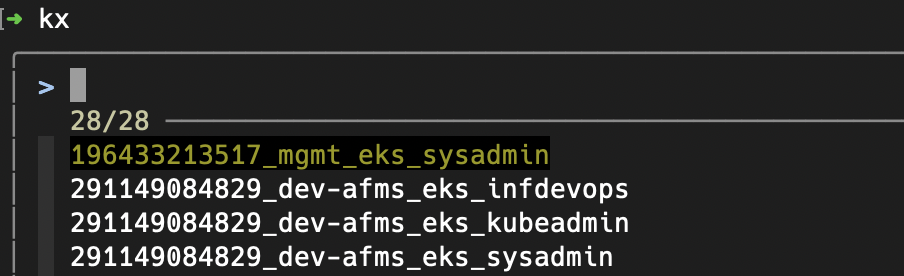


## Creating an AMI with Packer - Builder role

Building AMIs is automated through the ```packer-ami-<project-acronym>``` repos. However local testing (i.e. running packer locally) can speedup development and troubleshooting.  Since the process of building AMIs is centralized to the  _mgmt-sol-vfde (id:196433213517)_ account, users need to have permissions in that.
Thus the purpose of the ```Builder```role in _mgmt-sol-vfde_ is to allow users from all AWS accounts in the FusionC AWS Organisation to build AMIs.

The command and process are the same but prepend the commands run locally with shell alias of the Builder role: ```with_sol_\<short-alias\>\_builder```
For example:
- logging into the docker repo (Amazon ECR)
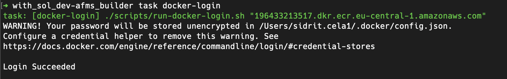

- running the container with the toolchains and checking the associated permissions
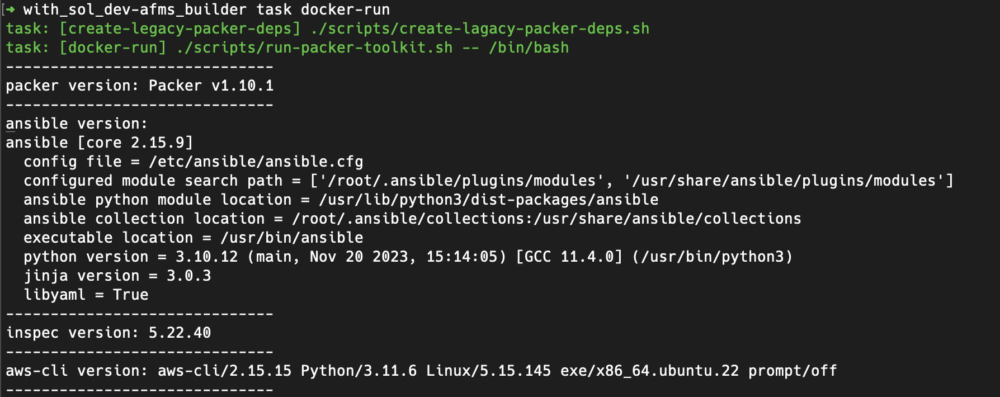
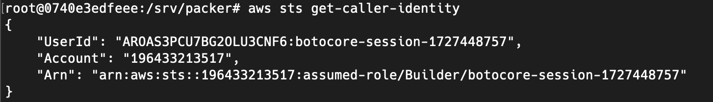

- running a packer build
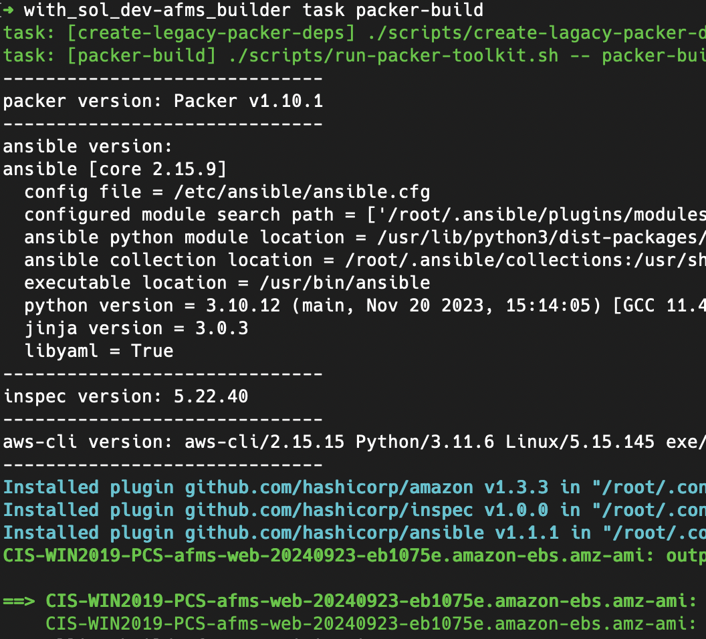

For more info refer to the [README](https://github.vodafone.com/VFDE-SOL/template-packer-ami) in the packer-ami repo.
