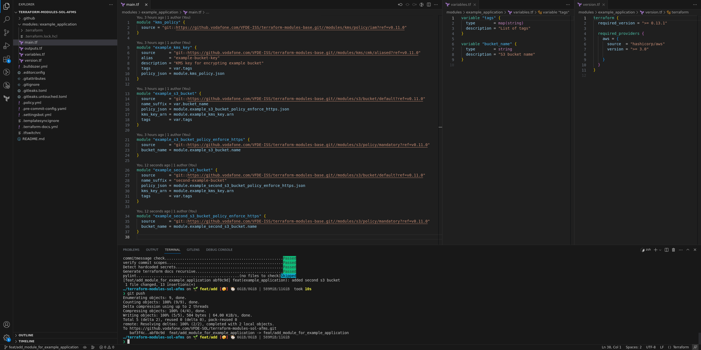

In this section we want to explain how to create a Terraform modules and deploy it in Solstice stage. Pre-requisites for effectively understanding the tutorial:  understanding of the [infrastructure repositories](../../infrastructure/infrastructure_development/), know the basics [core concepts]().

Before you start creating new modules have look at this repo [terraform-modules-sol-reference](https://github.vodafone.com/VFDE-SOL/terraform-modules-sol-reference/tree/master/modules), to get an idea at how we currently adivse to design project modules.

We will update this repo with more and more reference implemenations.

If a underlying component/module is missing a feature you need, please open an issue in its repo. Same goes for bugs.
You can also contribute with a PR.

## Module Development & Deployment

As we use Terraform modules to deploy infrastructure, we need to create a Terraform module that holds the corresponding code for the infrastructure that we want to deploy. For this tutorial we use the AFMS project as example to illustrate the steps needed to come up with an Terraform module and to deploy it to an environment.


### Create branch in modules repository

We want to create a module that is only meant for the AFMS project. Therefore the place to store this module is the AFMS modules repository (for further details on where to store a module, please refer to the [Infrastructure Codebase Architecture guide]()). The name of the module will be `example_application` as it provides the necessary infrastructure for an application. Before creating the necessary files we create a new branch in the AFMS modules repository with

```sh
git checkout -b feat/add_module_for_example_application
```

Now we can create a folder with the name of our module and place the Terraform code inside of it. For our example we will create a simple S3 bucket that only allows https connections for uploading objects and that is encrypted per default with a KMS customer managed key that we also create within the module.

| [](./infrastructure_development_guide_0.png)   |
|:-------------------------------------:|
| Terraform code for example_application module in AFMS modules repository in branch feat/add_module_for_example_application |


### Commit and push on modules repository

After we are done with the first draft of example_application module and we want to deploy it. Therefore we need to add it to the staging area, commit it to the recently created branch and push it.

| [](./infrastructure_development_guide_1.png)   |
|:-------------------------------------:|
| Terraform module code is now committed and pushed to remote.  |


### Create branch in project repository

Now that the code is committed to a branch of the modules repository we need to deploy it to an environment. Therefore we head over to the project repository. Here we choose the environment to which we want to deploy the module and add a Terragrunt configuration for it to the appropriate layer (for the most cases `application` should be a good choice).\
To add the new Terragrunt configuration we start again with creating a new branch.

```sh
git checkout -b feat/deploy_example_application_module_to_dev
```

### Add terragrunt.hcl file

Then we add it to the environment by creating a folder for the configuration of the new module in one of the layers of the environment, in this case we use the application layer. In this folder we need to add a `terragrunt.hcl` file.

| [](./infrastructure_development_guide_2.png)   |
|:-------------------------------------:|
| terragrunt.hcl configuration to deploy the example_application module to afms-dev environment. |

The `terragrunt.hcl` file contains the source of the module itself, _dependencies_ to other modules for using their outputs as inputs (for the example_application module we need mandatory tags, those are provided by the account_config module) as well as inputs we can set manually (in case of the the example_application module it is the bucket_name input).\
Before continuing, lets have a look at the source parameter.

```hcl
source = "git::https://github.vodafone.com/VFDE-SOL/terraform-modules-sol-afms.git//modules/example_application?ref=feat/add_module_for_example_application"
```

As mentioned, it points to the Terraform code of the module that we want to deploy. Therefore in our case it points to the modules repository of AFMS with

```hcl
source = "git::https://github.vodafone.com/VFDE-SOL/terraform-modules-sol-afms.git
```

As a modules repository usually hosts several modules in subfolders of the modules folder, we need to declare the module we want to source, therefore we need to append

```sh
//modules/example_application
```

As you can see this refers to the local path of the example_application module in the modules repository.\
Last but not least we need to refer to a tag which marks the version of our module. Actually we don't have a tag for the example_application module on the modules repository because we are in the mid of the development of the module. Therefore, *for the time of development*, we refer to the development branch of the module. This means that the last commit of the branch will get used by Terragrunt for deploying the Terrafrom code. So we need to append

```sh
?ref=feat/add_module_for_example_application"
```

### Add necessary terraform lock file
Now we are nearly done and ready to deploy the module but before we can deploy it we need to define the necessary Terraform providers for deploying. This is done via executing

```sh
terragrunt providers lock -platform=linux_arm64 -platform=linux_amd64 -platform=darwin_amd64 -platform=darwin_arm64 -platform=windows_amd64
```

in the folder of the example_application modules Terragrunt configuration.

| [](./infrastructure_development_guide_3.png)   |
|:-------------------------------------:|
| Create provider lock file for the example_application module deployment.  |

After this you will end up with a .terraform.lock.hcl file that keeps the providers and a .terragrunt-cache for local Terragrunt caching inside your modules folder. The .terragrunt-cache can be ignored as it is just for local purpose.

| [](./infrastructure_development_guide_4.png)   |
|:-------------------------------------:|
| terragrunt.hcl and its recently created lock file that pins the AWS provider version.  |


### Commit and push on project repo
Now we are ready to deploy the example_application module. To do so we need to commit the terragrunt.hcl as well as the .terraform.lock.hcl to our new branch.

| [](./infrastructure_development_guide_5.png)   |
|:-------------------------------------:|
| Commit Terragrunt configuration and its lock file.  |

After successfully committing, push it and open a PR for it in the GitHub web interface in a web browser. You can to this by following the link that gets provided in the console after you pushed the branch.

| [](./infrastructure_development_guide_6.png)   |
|:-------------------------------------:|
| Branch is now pushed and PR can be opened easily via the link provided in the console (marked in blue).  |

| [](./infrastructure_development_guide_7.png)   |
|:-------------------------------------:|
| Open a PR via GitHub web interface.  |


### Review Atlantis comments on PR

At this point in time our CICD system Atlantis kicks in. It will plan the module and comment the outputs of the plan to GitHub PR.

| [](./infrastructure_development_guide_8.png)   |
|:-------------------------------------:|
| Planing output as comment from Atlantis in the PR.  |


### Improve or rework module

If outcome is not satisfactory, you can start improving our Terraform code.\
Lets pretend that we want to improve the Terraform code of our module. Therefore we go back to the modules repository. There we want to add another S3 bucket to the example_application module. So we add the code for it, commit this change to the same branch we initially created in the modules repository and push it to remote.

| [](./infrastructure_development_guide_9.png)   |
|:-------------------------------------:|
| Adding a second s3 bucket to the example_application module.  |

| [](./infrastructure_development_guide_10.png)   |
|:-------------------------------------:|
| Push the changes to remote.  |

Now we want Atlantis to take notice of the change. Therefore we need to tell it to discard its initial plan (as it was done on the old code of the example_application module prior to our second commit for the additional S3 bucket). For this we can simply comment

```md
atlantis unlock
```

in the PR in GitHub. Atlantis will confirm with an additional comment. After it confirmed we want to make it planing again. For this simply comment

```md
atlantis plan
```

| [](./infrastructure_development_guide_11.png)   |
|:-------------------------------------:|
| Atlantis replaned based on our recent commit. Before it planed to add 5 resources, now with the added s3 bucket it plans to add 8 resources.  |


### Atlantis apply and merge

Now we are fine with the changes of the example_application module and we want to deploy it to the environment. After getting an approval for the PR we can now comment with

```md
atlantis apply
```

and make Atlantis deploy the example_application module.

| [](./infrastructure_development_guide_12.png)   |
|:-------------------------------------:|
| Atlantis applied the example_application module successfully to the dev-afms environment and merged the PR into the master branch.  |


### Create specific module tag

Now after the code has been successfully applied and merged into master by Atlantis, lets have a look at the master.

| [](./infrastructure_development_guide_13.png)   |
|:-------------------------------------:|
| The Terragrunt configuration for example_application module still points at the development branch of the module.  |

As we can see there is no fixed version of the example_application module referenced. Instead we are still referencing the development branch. This has to be changed as we want to refer to a fixed version when referencing a module (except for the time of development). Otherwise we can't be sure what is deployed because when referencing a branch, the most recent commit at the time of deploying with Terraform is used but what if there were some contributions made in the meantime?\
Therefore we will now switch over again to the module repository, merge the example_application module via PR into the master branch and tag a version for it.

| [](./infrastructure_development_guide_14.png)   |
|:-------------------------------------:|
| Create PR for the example_application module in the modules repository.  |

| [](./infrastructure_development_guide_15.png)   |
|:-------------------------------------:|
| example_application module is now merged into master and a version tag can be applied.  |

Now we tag a version for our recently developed module. A version tag for a modules repository consists always of the path of the module inside of the modules folder and a [semver](https://semver.org/) version. Therefore the version tag for the example_application module would be *example_application/v0.1.0*

| [](./infrastructure_development_guide_16.png)   |
|:-------------------------------------:|
| Version tag for the example_application module is now applied and pushed to remote.  |


### Using the new module via tag

After we have applied the version tag we can now reference a fixed version of the example_application module in the project repository. Therefore we head back to the project repository and create a new branch as we want to change the reference for the example_application module from the (no more existing) development branch of the modules repo to the fixed version tag we recently created. To do so we only need to change the ref section of the source attribute.

| [](./infrastructure_development_guide_17.png)   |
|:-------------------------------------:|
| Now we source the example_application module in v0.1.0 using the tag example_application/v0.1.0  |

As you can see we only need to change

```hcl
?ref=feat/add_module_for_example_application"
```

to

```hcl
?ref=example_application/v0.1.0"
```

After successfully committing the change we push it to the remote, open a PR in the project repository like we did before and merge our change into master.

| [](./infrastructure_development_guide_18.png)   |
|:-------------------------------------:|
| Open a PR to merge changed sourcing of example_application module to master.  |

| [](./infrastructure_development_guide_19.png)   |
|:-------------------------------------:|
| Atlantis applied the example_application with the changed source without any changes to the infrastructure as the codebase of the module didn't change (because the version tag refers to the same commit that was used prior to deploy from the development branch). After successfully applying it merged the change into the master branch.  |

Now we are done and the example_application module is deployed in v0.1.0 to the dev-afms environment. For deploying infrastructure to other projects/environments you can proceed the same way.
